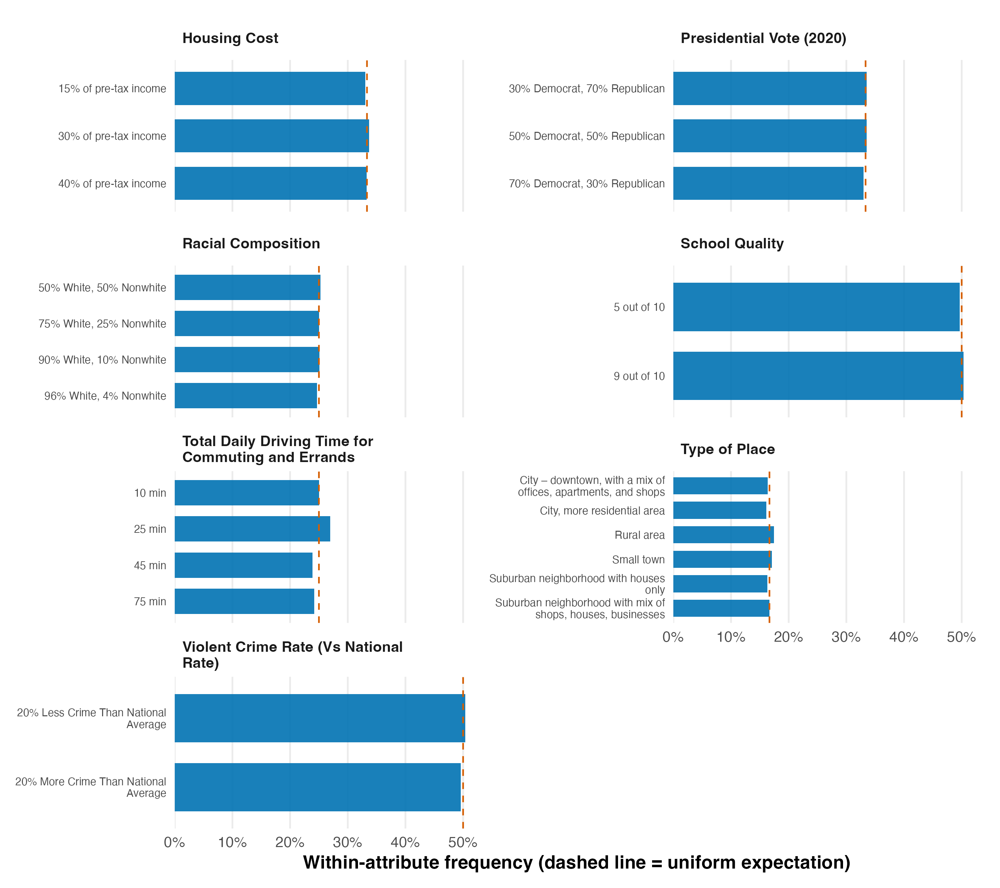

# T1 — Design summary: `exampleData1` community-choice conjoint

*Reference solution (answer key). All numbers computed from
`projoint::exampleData1` reshaped with the 8 choice tasks plus the repeated
task. projoint version 1.1.1, R 4.5.1.*

## Design at a glance

| Quantity | Value |
|---|---|
| Respondents | 400 |
| Choice tasks per respondent | 8 |
| Profiles per task | 2 |
| Total profile rows (long format) | 6400 |
| Total choice tasks | 3200 |
| Attributes | 7 |
| Repeated task (reliability) | 1 (task 1 repeated, flipped) |
| Repeated-task agreement (raw IRR) | 71.5% of 800 repeated profiles |

Exactly one profile is selected in each of the 3,200 choice tasks
(`selected`: 3,200 ones / 3,200 zeros), as expected for a forced-choice
design.

## Attributes and levels

| Attribute | # levels | Levels |
|---|---|---|
| Housing Cost | 3 | 15% of pre-tax income; 30% of pre-tax income; 40% of pre-tax income |
| Presidential Vote (2020) | 3 | 30% Democrat, 70% Republican; 50% Democrat, 50% Republican; 70% Democrat, 30% Republican |
| Racial Composition | 4 | 50% White, 50% Nonwhite; 75% White, 25% Nonwhite; 90% White, 10% Nonwhite; 96% White, 4% Nonwhite |
| School Quality | 2 | 5 out of 10; 9 out of 10 |
| Total Daily Driving Time for Commuting and Errands | 4 | 10 min; 25 min; 45 min; 75 min |
| Type of Place | 6 | City – downtown, with a mix of offices, apartments, and shops; City, more residential area; Rural area; Small town; Suburban neighborhood with houses only; Suburban neighborhood with mix of shops, houses, businesses |
| Violent Crime Rate (Vs National Rate) | 2 | 20% Less Crime Than National Average; 20% More Crime Than National Average |

## Randomization balance check

For a properly randomized conjoint, levels should appear about equally often
*within* each attribute. The table reports the observed within-attribute
proportion range, the largest absolute deviation from the uniform
expectation (1 / #levels), and an approximate chi-square goodness-of-fit test
against uniformity. (Profiles are not fully independent — 2 per task — so the
chi-square p-values are heuristic, not exact.)

| Attribute | # levels | Min prop | Max prop | Max abs. dev. | chi-sq (df) | p |
|---|---|---|---|---|---|---|
| Housing Cost | 3 | 33.0% | 33.7% | 0.34 pp | 0.40 (2) | 0.820 |
| Presidential Vote (2020) | 3 | 33.0% | 33.5% | 0.38 pp | 0.42 (2) | 0.811 |
| Racial Composition | 4 | 24.6% | 25.3% | 0.36 pp | 0.55 (3) | 0.908 |
| School Quality | 2 | 49.7% | 50.3% | 0.34 pp | 0.30 (1) | 0.582 |
| Total Daily Driving Time for Commuting and Errands | 4 | 23.9% | 26.9% | 1.94 pp | 14.63 (3) | 0.002 |
| Type of Place | 6 | 16.1% | 17.5% | 0.79 pp | 4.91 (5) | 0.427 |
| Violent Crime Rate (Vs National Rate) | 2 | 49.6% | 50.4% | 0.39 pp | 0.39 (1) | 0.532 |

**Verdict: sound, with one minor flag.** 6 of 7 attributes are statistically indistinguishable from uniform; Total Daily Driving Time for Commuting and Errands shows a *statistically detectable but substantively negligible* departure.

The largest single deviation across all attributes is 1.94 pp (under 2 pp). With 6,400 profile rows the chi-square test is highly powered, so it detects even trivial departures: Total Daily Driving Time for Commuting and Errands (chi-sq = 14.6, p = 0.002) (max dev. 1.94 pp, over-representation of its "25 min" level). A sub-2-pp imbalance does not threaten AMCE/MM estimation, but a careful analyst should disclose it rather than claim perfect balance. The other 6 attributes are essentially uniform (max dev. < 1 pp).

## Figure

**Figure 1.** Within-attribute frequency of each level in the reshaped
community-choice conjoint (400 respondents, 6,400 profile rows). Bars are
observed proportions; the dashed red line marks the uniform expectation
(1 / number of levels). Every level sits within 2 percentage points of its
uniform target; the only visible departure is a slight over-representation of the "25 min" level of Total Daily Driving Time (see balance table).

