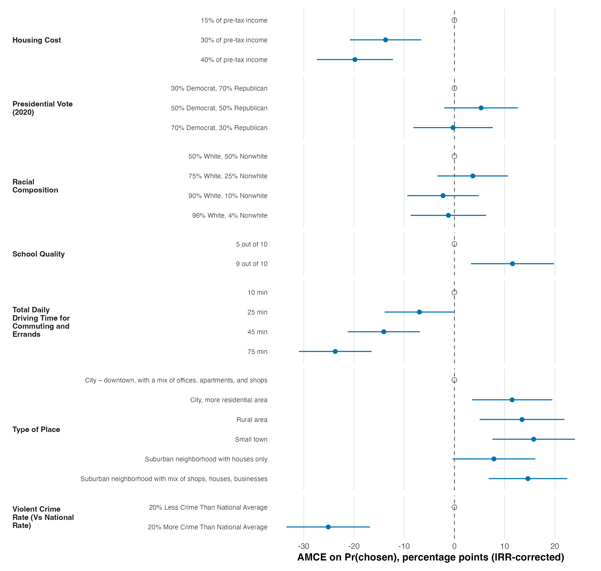

# T2 — AMCE results

*Reference solution (answer key). projoint 1.1.1, R 4.5.1.*

## Results

Across the seven attributes, community choice responds most strongly to **Violent Crime Rate (Vs National Rate)**: relative to the "20% Less Crime Than National Average" baseline, "20% More Crime Than National Average" changes the probability that a profile is chosen by **-25.1 percentage points** (pp) — the largest effect in the design and the study's headline attribute. Total Daily Driving Time is a close second: raising the commute from 10 to 75 minutes lowers choice by 23.7 pp, and each longer step reduces it monotonically (25 min -7.0, 45 min -14.1, 75 min -23.7 pp vs 10 min). Housing Cost is third: 40% of pre-tax income costs -19.8 pp relative to 15%. School Quality moves choice the other way — a 9/10 school raises it by +11.6 pp over a 5/10 school — as does a more built-up Type of Place (downtown is the least preferred baseline; small-town and residential-city options gain up to +15.8 pp). Racial Composition and Presidential Vote have the smallest, mostly indistinguishable-from-zero AMCEs (|effect| < 6 pp). Uncertainty: 95% confidence intervals are clustered on the respondent; the headline crime and driving-time effects are far from zero (intervals exclude 0 by a wide margin), whereas the racial-composition and vote effects are not.

## Estimation choices (projoint defaults — recorded per the brief)

- **Estimand / structure:** profile-level AMCE (`.estimand="amce"`, `.structure="profile_level"`), the Hainmueller-et-al. quantity.
- **IRR correction: ON.** projoint estimated intra-respondent reliability from the repeated task (tau = 0.172) and reports IRR-**corrected** AMCEs as its default headline quantity. Uncorrected AMCEs are ~1.52x smaller and are shown alongside in the table below.
- **SE method:** `"analytical"` (default), clustered on `id` at the respondent level via `.auto_cluster=TRUE`. NOTE: CR2 produced non-positive-definite variances, so projoint fell back to `se_type = "stata"` (Stata-style clustered SEs); this is a projoint-internal fallback, not an analyst choice.
- **Other defaults:** ties removed (`.remove_ties=TRUE`); profile position ignored (`.ignore_position=TRUE`).
- **Reproducibility:** the analytical path is deterministic — estimates and SEs are identical across seeds. `set.seed(46)` is set as a convention; it only matters if `.se_method` is changed to `"bootstrap"`/`"simulation"`.
- **Headline pick is robust:** Violent Crime Rate (Vs National Rate) has the largest |AMCE| under *both* the corrected and the uncorrected estimand.

## Figure

**Figure 1.** IRR-corrected AMCEs on the probability a profile is chosen, in percentage points, with 95% respondent-clustered confidence intervals. Levels are grouped by attribute; the reference level of each attribute is the open grey point fixed at 0. Negative values mean the level makes a profile *less* likely to be chosen than the reference. Violent crime and long commutes are the strongest deterrents.

## Full estimates (percentage points)

| Attribute | Level | AMCE corrected | 95% CI | AMCE uncorrected |
|---|---|---|---|---|
| Housing Cost | 15% of pre-tax income | 0.0 *(ref)* | — | 0.0 *(ref)* |
| | 30% of pre-tax income | -13.7 | [-20.8, -6.6] | -9.0 |
| | 40% of pre-tax income | -19.8 | [-27.4, -12.2] | -13.0 |
| Presidential Vote (2020) | 30% Democrat, 70% Republican | 0.0 *(ref)* | — | 0.0 *(ref)* |
| | 50% Democrat, 50% Republican | +5.3 | [-2.0, +12.6] | +3.5 |
| | 70% Democrat, 30% Republican | -0.3 | [-8.2, +7.6] | -0.2 |
| Racial Composition | 50% White, 50% Nonwhite | 0.0 *(ref)* | — | 0.0 *(ref)* |
| | 75% White, 25% Nonwhite | +3.7 | [-3.4, +10.7] | +2.4 |
| | 90% White, 10% Nonwhite | -2.3 | [-9.4, +4.8] | -1.5 |
| | 96% White, 4% Nonwhite | -1.2 | [-8.7, +6.3] | -0.8 |
| School Quality | 5 out of 10 | 0.0 *(ref)* | — | 0.0 *(ref)* |
| | 9 out of 10 | +11.6 | [+3.3, +19.8] | +7.6 |
| Total Daily Driving Time for Commuting and Errands | 10 min | 0.0 *(ref)* | — | 0.0 *(ref)* |
| | 25 min | -7.0 | [-13.9, 0.0] | -4.6 |
| | 45 min | -14.1 | [-21.2, -6.9] | -9.2 |
| | 75 min | -23.7 | [-31.0, -16.5] | -15.6 |
| Type of Place | City – downtown, with a mix of offices, apartments, and shops | 0.0 *(ref)* | — | 0.0 *(ref)* |
| | City, more residential area | +11.5 | [+3.5, +19.5] | +7.5 |
| | Rural area | +13.5 | [+5.0, +21.9] | +8.8 |
| | Small town | +15.8 | [+7.6, +24.0] | +10.3 |
| | Suburban neighborhood with houses only | +7.9 | [-0.4, +16.1] | +5.2 |
| | Suburban neighborhood with mix of shops, houses, businesses | +14.6 | [+6.8, +22.4] | +9.6 |
| Violent Crime Rate (Vs National Rate) | 20% Less Crime Than National Average | 0.0 *(ref)* | — | 0.0 *(ref)* |
| | 20% More Crime Than National Average | -25.1 | [-33.4, -16.8] | -16.5 |

