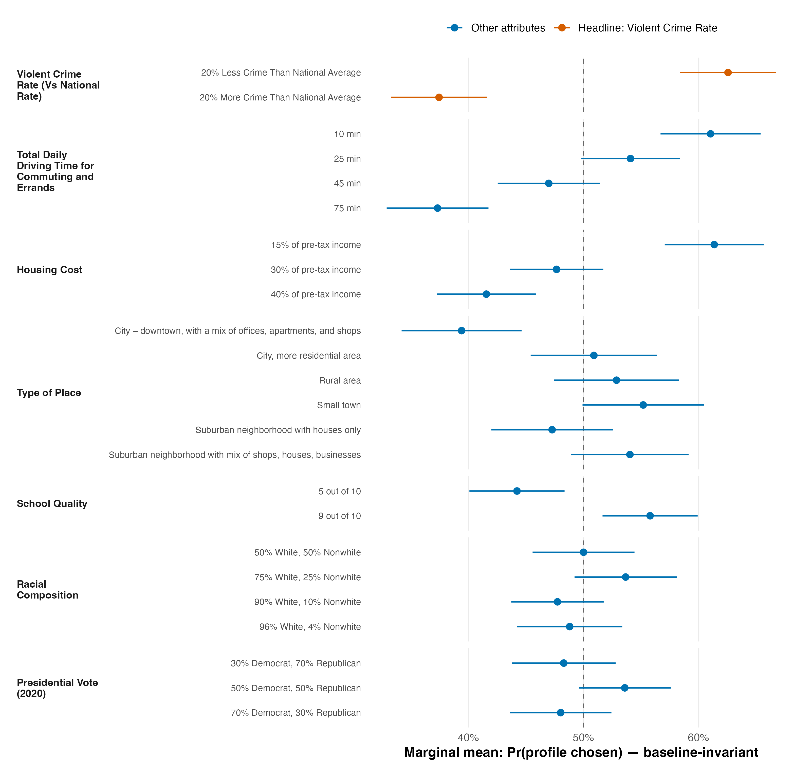

# T3 — Baseline-sensitivity of the headline finding (sensitivity table)

*Reference solution (answer key). Headline attribute (T2) = **Violent Crime
Rate**, which is a **binary** attribute. projoint 1.1.1, R 4.5.1. All AMCEs
IRR-corrected unless noted; percentage points.*

## 1. Headline attribute (Violent Crime Rate) under each baseline

A 2-level attribute admits only two possible baselines, so there is exactly
one alternative to the manuscript's default. Flipping it does not change the
magnitude — only the sign and the verbal framing.

| Reference set | Contrast estimated | AMCE (corrected) | 95% CI | AMCE (uncorrected) |
|---|---|---|---|---|
| **Default** (baseline = *20% Less Crime Than National Average*) | 20% More Crime Than National Average vs baseline | -25.1 | [-33.4, -16.8] | -16.5 |
| **Alternative** (baseline = *20% More Crime Than National Average*) | 20% Less Crime Than National Average vs baseline | +25.1 | [+16.8, +33.4] | +16.5 |

**|AMCE| is identical (25.1 pp corrected, 16.5 pp uncorrected) under both baselines.** The effect of Violent Crime Rate is therefore *not* an artifact of the reference category: for a binary attribute the AMCE and the marginal-mean gap are the same number.

## 2. A multi-level attribute (Total Daily Driving Time) — where the reviewer is right

For an attribute with >2 levels the reported level-vs-baseline AMCEs *do*
change when the baseline is relabeled. Same data, two baselines:

| Level | AMCE vs *10 min* (default) | AMCE vs *75 min* (alt) |
|---|---|---|
| 10 min | 0.0 *(ref)* | +23.7 |
| 25 min | -7.0 | +16.8 |
| 45 min | -14.1 | +9.7 |
| 75 min | -23.7 | 0.0 *(ref)* |

Every number in the first column differs from the second, yet the *spread* of the attribute (max AMCE minus min AMCE = 23.7 pp) is preserved, and so are all pairwise level differences. This is exactly the mechanical dependence the reviewer names — real, but a relabeling, not a change in substance.

## 3. Marginal means for ALL levels (the baseline-invariant quantity)

Marginal means do not reference any baseline. They are the primitive; every
AMCE is a difference of two of them.

| Attribute | Level | Marginal mean | 95% CI |
|---|---|---|---|
| Housing Cost | 15% of pre-tax income | 61.4% | [57.1%, 65.7%] |
|  | 30% of pre-tax income | 47.7% | [43.6%, 51.7%] |
|  | 40% of pre-tax income | 41.6% | [37.2%, 45.9%] |
| Presidential Vote (2020) | 30% Democrat, 70% Republican | 48.3% | [43.8%, 52.8%] |
|  | 50% Democrat, 50% Republican | 53.6% | [49.6%, 57.6%] |
|  | 70% Democrat, 30% Republican | 48.0% | [43.6%, 52.4%] |
| Racial Composition | 50% White, 50% Nonwhite | 50.0% | [45.6%, 54.4%] |
|  | 75% White, 25% Nonwhite | 53.7% | [49.2%, 58.1%] |
|  | 90% White, 10% Nonwhite | 47.7% | [43.7%, 51.8%] |
|  | 96% White, 4% Nonwhite | 48.8% | [44.2%, 53.4%] |
| School Quality | 5 out of 10 | 44.2% | [40.1%, 48.4%] |
|  | 9 out of 10 | 55.8% | [51.6%, 59.9%] |
| Total Daily Driving Time for Commuting and Errands | 10 min | 61.0% | [56.7%, 65.4%] |
|  | 25 min | 54.1% | [49.8%, 58.4%] |
|  | 45 min | 47.0% | [42.5%, 51.4%] |
|  | 75 min | 37.3% | [32.9%, 41.7%] |
| Type of Place | City – downtown, with a mix of offices, apartments, and shops | 39.4% | [34.2%, 44.6%] |
|  | City, more residential area | 50.9% | [45.4%, 56.4%] |
|  | Rural area | 52.9% | [47.4%, 58.3%] |
|  | Small town | 55.2% | [49.9%, 60.5%] |
|  | Suburban neighborhood with houses only | 47.3% | [42.0%, 52.6%] |
|  | Suburban neighborhood with mix of shops, houses, businesses | 54.0% | [48.9%, 59.1%] |
| Violent Crime Rate (Vs National Rate) | 20% Less Crime Than National Average | 62.6% | [58.4%, 66.7%] |
|  | 20% More Crime Than National Average | 37.4% | [33.3%, 41.6%] |

## 4. Attribute importance by MM range (baseline-invariant ordering)

| Rank | Attribute | MM range (max - min) |
|---|---|---|
| 1 | Violent Crime Rate (Vs National Rate) | 25.1 pp |
| 2 | Total Daily Driving Time for Commuting and Errands | 23.7 pp |
| 3 | Housing Cost | 19.8 pp |
| 4 | Type of Place | 15.8 pp |
| 5 | School Quality | 11.6 pp |
| 6 | Racial Composition | 5.9 pp |
| 7 | Presidential Vote (2020) | 5.6 pp |

The ordering is fixed regardless of any reference-category choice. Violent Crime Rate ranks #1 (25.1 pp), but only ~1.4 pp ahead of Total Daily Driving Time (23.7 pp); their endpoint CIs overlap heavily, so the #1-vs-#2 gap is within sampling error. Housing Cost (19.8 pp) is a close third.

## Figure

**Figure 1.** IRR-corrected marginal means (Pr a profile is chosen) for every attribute level, with 95% respondent-clustered CIs; attributes are ordered top-to-bottom by decreasing importance (within-attribute MM range). Marginal means are baseline-invariant. Violent Crime Rate (orange) has the widest spread — 62.6% for less crime vs 37.4% for more crime — but Driving Time is a close second, so crime is the largest single driver, not a dominant one.

