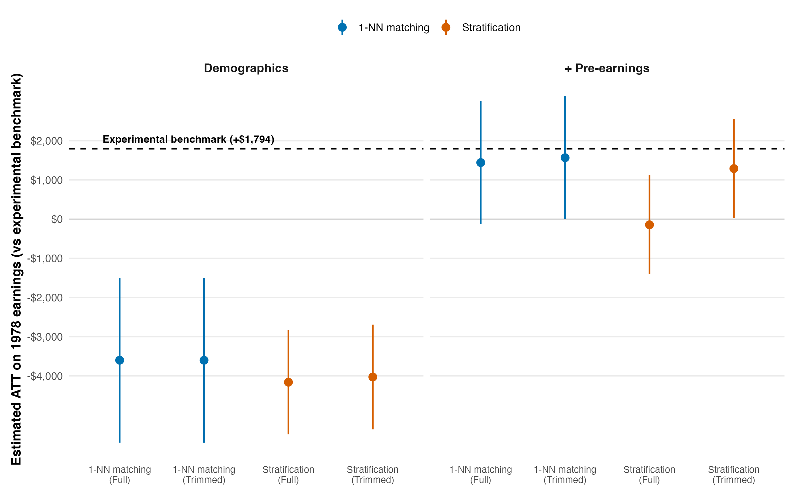

# VHIGH — Does propensity-score matching recover the experimental benchmark? (specification table)

*Reference solution (answer key). Data: `causaldata::nsw_mixtape` (185 treated
+ 260 experimental controls) and `causaldata::cps_mixtape` (15,992 CPS
controls). R 4.5.1. Propensity matching hand-rolled in base R + glm for exact
reproducibility (see `script.R` header). Estimand: ATT on 1978 earnings
(`re78`), dollars. Point estimates deterministic; CIs are cluster-robust
(1-NN) / analytic-stratum (stratification), NOT a bootstrap — see the
inference note below.*

## 0. The two anchors

| Quantity | Definition | Value |
|---|---|---:|
| **Experimental benchmark** | mean `re78`, NSW treated (185) − NSW control (260) | **+$1,794** |
| **Naive observational** | mean `re78`, NSW treated (185) − CPS controls (15,992) | **-$8,498** |

The experiment says the program raised 1978 earnings by about **+$1,794**. Simply differencing the NSW treated against the CPS pool gives **-$8,498** — wrong in sign and off by roughly **$10,292**, because the CPS controls are older, better-educated, far more often married, mostly not Black, and earn ~$14k vs ~$2k pre-program. The question is whether conditioning on observables via the propensity score closes that gap.

## 1. The specification grid (ATT vs the benchmark)

Eight specifications: covariate set {demographics; + pre-earnings `re74`,`re75`}
× estimator {1-NN with replacement; 5-quintile stratification} × support {full;
trimmed to common support}.

| # | Covariates | Estimator | Support | ATT (95% CI) | Gap vs benchmark |
|---|---|---|---|---:|---:|
| 1 | Demographics | 1-NN matching | Full | -$3,601 [-$5,704, -$1,497] | -$5,395 |
| 2 | Demographics | Stratification* | Full | -$4,162 [-$5,491, -$2,833] | -$5,956 |
| 3 | Demographics | 1-NN matching | Trimmed | -$3,601 [-$5,704, -$1,497] | -$5,395 |
| 4 | Demographics | Stratification | Trimmed | -$4,028 [-$5,364, -$2,693] | -$5,823 |
| 5 | + Pre-earnings | 1-NN matching | Full | +$1,443 [-$125, +$3,010] | -$352 |
| 6 | + Pre-earnings | Stratification* | Full | -$144 [-$1,406, +$1,119] | -$1,938 |
| 7 | + Pre-earnings | 1-NN matching | Trimmed | +$1,566 [-$1, +$3,134] | -$228 |
| 8 | + Pre-earnings | Stratification | Trimmed | +$1,290 [+$25, +$2,555] | -$505 |

\* **Unrestricted stratification** (full support): the outer strata absorb
CPS controls whose pscore lies below the treated range, so the endpoint
subclass means include plainly non-comparable controls. Read it as a
diagnostic of what happens when overlap is ignored, not as an equally
defensible estimator.

## 2. Per-specification diagnostics (why the estimates move)

Balance is audited on **all eight covariates including `re74`/`re75`**, so a
demographics-only model is scored on the earnings imbalance it leaves behind.
Common support by range-intersection is a weak overlap check (it can retain
local sparsity); the retention column reports how much of the CPS pool each
trim discards.

| # | Covariates | Estimator | Support | Controls used | Max \|SMD\| (all covars) | Mean pscore dist. | CPS dropped by trim |
|---|---|---|---|---:|---:|---:|---:|
| 1 | Demographics | 1-NN matching | Full | 119 | 2.26 | 0.0003 | 0 |
| 2 | Demographics | Stratification* | Full | 15,992 | 2.14 | — | 0 |
| 3 | Demographics | 1-NN matching | Trimmed | 119 | 2.26 | 0.0003 | 3,286 |
| 4 | Demographics | Stratification | Trimmed | 12,706 | 2.08 | — | 3,286 |
| 5 | + Pre-earnings | 1-NN matching | Full | 126 | 0.40 | 0.0004 | 0 |
| 6 | + Pre-earnings | Stratification* | Full | 15,992 | 0.61 | — | 0 |
| 7 | + Pre-earnings | 1-NN matching | Trimmed | 126 | 0.40 | 0.0004 | 10,216 |
| 8 | + Pre-earnings | Stratification | Trimmed | 5,776 | 0.24 | — | 10,216 |

## 3. Reading the grid

**Pre-treatment earnings are the load-bearing covariate.** Every demographics-only specification lands between -$4,162 and -$3,601 — still negative, still $5,956–$5,395 below the benchmark, essentially no better than the naive gap in sign. The diagnostic explains why: matching on demographics alone leaves a post-match max \|SMD\| of **2.26**, driven by the earnings variables it never conditioned on. Adding `re74`/`re75` drops that imbalance to **0.40**.

**With pre-earnings the estimate is *closer* to the benchmark — but how close, and how stably, depends on the estimator and the support.** The three well-implemented pre-earnings specifications cluster in a narrow **+$1,290–+$1,566** band (1-NN +$1,443 full / +$1,566 trimmed; stratification +$1,290 on common support), each landing $228–$505 *below* the benchmark with a CI that still covers it. But the *unrestricted* stratification cell over the same score collapses to -$144 — a **$1,710 swing** produced by an overlap-handling choice alone. Pre-earnings matching gets close; it does not pin the benchmark, and a careless support choice can still return essentially zero.

**The trim asymmetry is empirical, not a law.** Trimming barely moves 1-NN here (+$1,443 → +$1,566) because a nearest-neighbor rule already draws only in-support controls; it moves stratification a lot (-$144 → +$1,290) because subclass means average over every in-stratum control, including the poorly-overlapping ones the trim removes. This is a property of *these* data and estimators, not a general guarantee that nearest-neighbor matching is trim-robust — 1-NN picks the least-distant control, which need not be a close one.

## 4. The calibrated verdict

In this CPS-based reconstruction, conditioning on pre-treatment earnings substantially improves the nearest-neighbor estimate and moves it close to the experimental benchmark, while a demographics-only model does not. But agreement with the benchmark is **specification-dependent** — it varies with estimator and support — so the exercise does **not** establish robust recovery. Neither slogan survives: not an unconditional "matching works" (Dehejia-Wahba), because the win requires the right conditioning set and a favorable estimator/support; and not an unconditional "matching fails" (Smith-Todd), because the pre-earnings 1-NN estimates land near the benchmark and remove most of the naive bias. Matching **helps but does not settle** LaLonde's critique. And because this is a single CPS-based comparison sample, it is a sensitivity demonstration, not a complete historical adjudication of the dispute.

## Figure

**Figure 1.** Estimated ATT of the NSW program on 1978 earnings across eight observational specifications, faceted by covariate set; the dashed line is the experimental benchmark (+$1,794). Whiskers are 95% intervals (cluster-robust for 1-NN, analytic-stratum for stratification) and **exclude propensity-score-estimation uncertainty** — the finding is the spread of point estimates across specifications, not any single interval. Demographics-only specifications (left) sit far below the benchmark; adding pre-treatment earnings (right) pulls the 1-NN estimates up to it, but stratification over the same score still disagrees.

