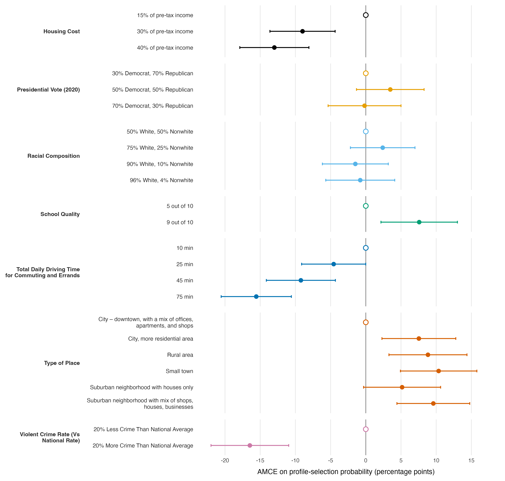

## Results

Using 6,400 profile observations from 400 respondents, we estimated conventional, uncorrected average marginal component effects (AMCEs) on the probability that a profile was selected. The largest effect concerned crime: relative to a location with 20% less crime than the national average, one with 20% more crime was 16.5 percentage points less likely to be chosen (95% CI: −22.0, −11.0). Long travel times were similarly consequential. Relative to 10 minutes of daily driving, 75 minutes reduced selection by 15.6 points (95% CI: −20.5, −10.6), while 45 minutes reduced it by 9.2 points (95% CI: −14.1, −4.3). Housing costs of 40% and 30% of pretax income reduced selection by 13.0 and 9.0 points, respectively, compared with 15%. Relative to a mixed-use downtown, small towns (+10.3 points), mixed-use suburban neighborhoods (+9.6), rural areas (+8.8), and residential city areas (+7.5) were favored. A school-quality rating of 9 rather than 5 increased selection by 7.6 points. By contrast, both presidential-vote contrasts and all racial-composition contrasts had confidence intervals spanning zero. Uncertainty was estimated with analytical Stata-style standard errors clustered by respondent; the intervals were tight enough to distinguish the largest crime, travel, housing, school, and place-type effects from zero.

*Figure 1. Uncorrected AMCEs on the probability of profile selection. Points show estimates and horizontal bars show 95% confidence intervals based on analytical, respondent-clustered (ID) Stata-style standard errors. Open circles mark reference levels, which are fixed at zero for display and have no estimated uncertainty.*
