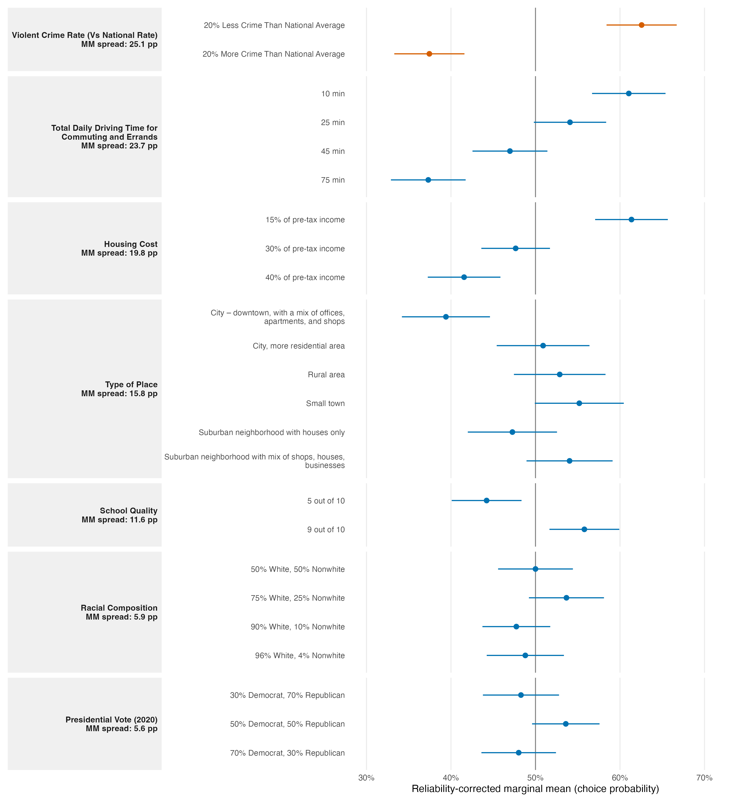

# Reply to the reviewer

The reviewer is correct about one mechanical point, but the stronger artifact claim does not survive re-estimation. An AMCE is a contrast with a named reference level, so changing that reference changes the reported coefficient. For the binary crime attribute, however, there is only one pairwise comparison. With 20% less crime as the reference, 20% more crime has an AMCE of -25.1 percentage points (95% CI -33.4 to -16.8). Reversing the reference produces +25.1 points (16.8 to 33.4): the same gap and uncertainty with the sign reversed. There is therefore no alternative crime baseline that can change the magnitude or ordering of its two levels.

The multi-level check shows why the reviewer’s general warning still matters. For daily driving time, using 10 minutes as the reference yields three negative AMCEs and makes 75 minutes the largest absolute coefficient; using 75 minutes yields three positive AMCEs and makes 10 minutes the largest. Yet all fitted pairwise contrasts are preserved: 75 versus 10 minutes is -23.7 points, while 10 versus 75 minutes is +23.7. Reference coding changes the questions attached to coefficients, not the underlying fitted comparisons or level ordering.

Marginal means provide the clean baseline-free summary. The estimated choice probability is 62.6% (58.4% to 66.7%) for communities with 20% less crime and 37.4% (33.3% to 41.6%) for those with 20% more crime, a 25.1-point spread. This is the largest point-estimated within-attribute MM spread in these data, but only narrowly: daily driving time spans 23.7 points and housing cost 19.8 points. A 1.4-point descriptive lead over driving time does not warrant describing crime as uniquely more important. Cross-attribute rankings also depend on the level ranges and number of levels the design presents.

We will replace “crime drives community choice” with: **“We find a large crime-rate contrast in this design: profiles with 20% less crime than the national average had a 25.1-percentage-point higher reliability-corrected choice probability than profiles with 20% more crime, one of the largest level contrasts among the attributes presented.”** We will report MMs as the primary comparison and retain re-referenced AMCEs as a sensitivity check. This supports a strong low-versus-high-crime preference, not a claim of unique dominance.

*Figure 1. Reliability-corrected profile-level marginal means with respondent-clustered 95% confidence intervals. Facets are ordered by their observed MM spread; this ordering is descriptive, not a test that spreads differ.*

