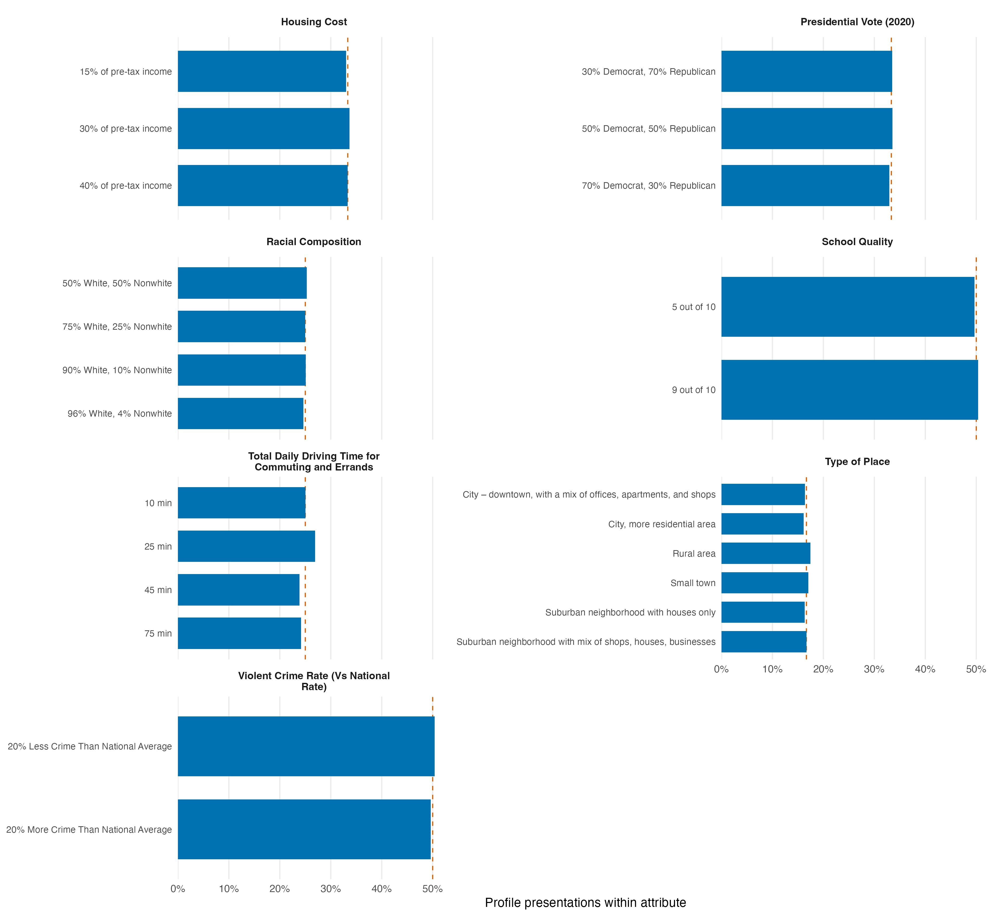

# Descriptive design summary

The reshaped experimental data contain **400 unique respondents**, **8 experimental tasks per respondent**, and **2 profiles per task** (6400 profile presentations total).

The `choice1_repeated_flipped` outcome is represented by the reliability fields (`selected_repeated` and `agree`); it is not a ninth randomized profile task.

## Attributes and levels

| Attribute ID | Attribute | Levels |
|---|---|---:|
| att1 | Housing Cost | 3 |
| att2 | Presidential Vote (2020) | 3 |
| att3 | Racial Composition | 4 |
| att4 | School Quality | 2 |
| att5 | Total Daily Driving Time for Commuting and Errands | 4 |
| att6 | Type of Place | 6 |
| att7 | Violent Crime Rate (Vs National Rate) | 2 |

## Randomization balance

Each attribute is tabulated over all 6,400 profile presentations. Expected percentages assume equal allocation across that attribute's labeled levels.

| Attribute | Level | Count | Percent within attribute | Expected percent | Deviation (pp) |
|---|---|---:|---:|---:|---:|
| Housing Cost | 15% of pre-tax income | 2114 | 33.03% | 33.33% | -0.30 |
| Housing Cost | 30% of pre-tax income | 2155 | 33.67% | 33.33% | +0.34 |
| Housing Cost | 40% of pre-tax income | 2131 | 33.30% | 33.33% | -0.04 |
| Presidential Vote (2020) | 30% Democrat, 70% Republican | 2144 | 33.50% | 33.33% | +0.17 |
| Presidential Vote (2020) | 50% Democrat, 50% Republican | 2147 | 33.55% | 33.33% | +0.21 |
| Presidential Vote (2020) | 70% Democrat, 30% Republican | 2109 | 32.95% | 33.33% | -0.38 |
| Racial Composition | 50% White, 50% Nonwhite | 1618 | 25.28% | 25.00% | +0.28 |
| Racial Composition | 75% White, 25% Nonwhite | 1600 | 25.00% | 25.00% | +0.00 |
| Racial Composition | 90% White, 10% Nonwhite | 1605 | 25.08% | 25.00% | +0.08 |
| Racial Composition | 96% White, 4% Nonwhite | 1577 | 24.64% | 25.00% | -0.36 |
| School Quality | 5 out of 10 | 3178 | 49.66% | 50.00% | -0.34 |
| School Quality | 9 out of 10 | 3222 | 50.34% | 50.00% | +0.34 |
| Total Daily Driving Time for Commuting and Errands | 10 min | 1601 | 25.02% | 25.00% | +0.02 |
| Total Daily Driving Time for Commuting and Errands | 25 min | 1724 | 26.94% | 25.00% | +1.94 |
| Total Daily Driving Time for Commuting and Errands | 45 min | 1527 | 23.86% | 25.00% | -1.14 |
| Total Daily Driving Time for Commuting and Errands | 75 min | 1548 | 24.19% | 25.00% | -0.81 |
| Type of Place | City – downtown, with a mix of offices, apartments, and shops | 1047 | 16.36% | 16.67% | -0.31 |
| Type of Place | City, more residential area | 1032 | 16.12% | 16.67% | -0.54 |
| Type of Place | Rural area | 1117 | 17.45% | 16.67% | +0.79 |
| Type of Place | Small town | 1092 | 17.06% | 16.67% | +0.40 |
| Type of Place | Suburban neighborhood with houses only | 1045 | 16.33% | 16.67% | -0.34 |
| Type of Place | Suburban neighborhood with mix of shops, houses, businesses | 1067 | 16.67% | 16.67% | +0.01 |
| Violent Crime Rate (Vs National Rate) | 20% Less Crime Than National Average | 3225 | 50.39% | 50.00% | +0.39 |
| Violent Crime Rate (Vs National Rate) | 20% More Crime Than National Average | 3175 | 49.61% | 50.00% | -0.39 |

## Level-frequency figure

Within each attribute, blue bars show the percentage of 6,400 profile presentations assigned to each level, and the dashed vermillion line marks equal allocation.

