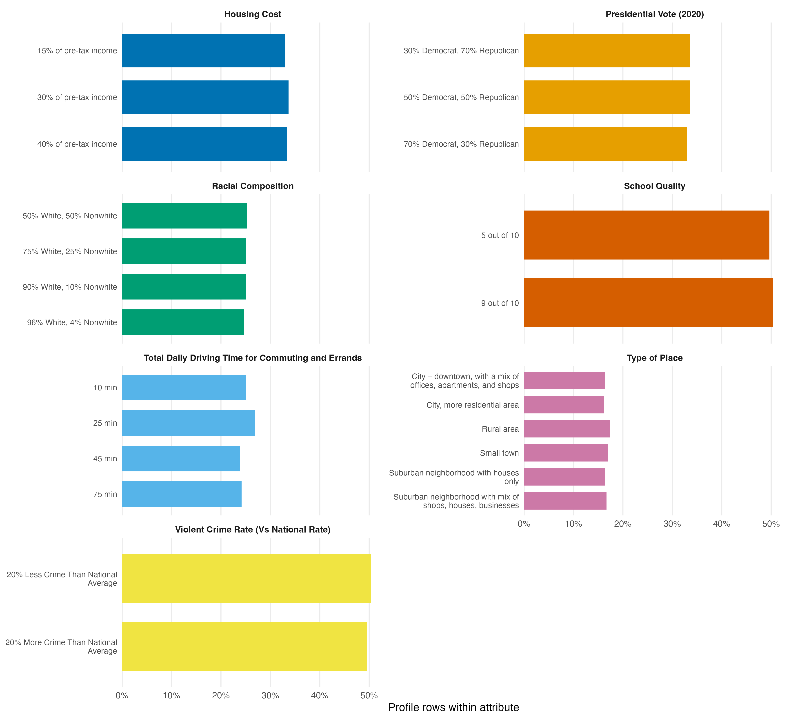

# Design summary

The reshaped analysis design contains **400 respondents**, **8 primary randomized tasks per respondent**, **2 profiles per task**, and **6,400 primary-task profile rows**.

The repeated reliability outcome is attached to task 1 in selected_repeated and agree. It is a reliability check, not a ninth randomized profile task.

## Attributes and levels

| Attribute ID | Attribute | Level count |
|---|---|---|
| att1 | Housing Cost | 3 |
| att2 | Presidential Vote (2020) | 3 |
| att3 | Racial Composition | 4 |
| att4 | School Quality | 2 |
| att5 | Total Daily Driving Time for Commuting and Errands | 4 |
| att6 | Type of Place | 6 |
| att7 | Violent Crime Rate (Vs National Rate) | 2 |

The seven attributes, in att1 through att7 order, contain **24 levels** in total.

## Randomization balance

For every attribute, the counts below cover all 6,400 primary-task profile rows; within-attribute percentages therefore sum to 100.0% (apart from displayed rounding). The level frequencies are close to evenly distributed within each attribute, consistent with the intended randomization.

| Attribute ID | Attribute | Level | Count | Within-attribute percent |
|---|---|---|---|---|
| att1 | Housing Cost | 15% of pre-tax income | 2,114 | 33.0% |
| att1 | Housing Cost | 30% of pre-tax income | 2,155 | 33.7% |
| att1 | Housing Cost | 40% of pre-tax income | 2,131 | 33.3% |
| att2 | Presidential Vote (2020) | 30% Democrat, 70% Republican | 2,144 | 33.5% |
| att2 | Presidential Vote (2020) | 50% Democrat, 50% Republican | 2,147 | 33.5% |
| att2 | Presidential Vote (2020) | 70% Democrat, 30% Republican | 2,109 | 33.0% |
| att3 | Racial Composition | 50% White, 50% Nonwhite | 1,618 | 25.3% |
| att3 | Racial Composition | 75% White, 25% Nonwhite | 1,600 | 25.0% |
| att3 | Racial Composition | 90% White, 10% Nonwhite | 1,605 | 25.1% |
| att3 | Racial Composition | 96% White, 4% Nonwhite | 1,577 | 24.6% |
| att4 | School Quality | 5 out of 10 | 3,178 | 49.7% |
| att4 | School Quality | 9 out of 10 | 3,222 | 50.3% |
| att5 | Total Daily Driving Time for Commuting and Errands | 10 min | 1,601 | 25.0% |
| att5 | Total Daily Driving Time for Commuting and Errands | 25 min | 1,724 | 26.9% |
| att5 | Total Daily Driving Time for Commuting and Errands | 45 min | 1,527 | 23.9% |
| att5 | Total Daily Driving Time for Commuting and Errands | 75 min | 1,548 | 24.2% |
| att6 | Type of Place | City – downtown, with a mix of offices, apartments, and shops | 1,047 | 16.4% |
| att6 | Type of Place | City, more residential area | 1,032 | 16.1% |
| att6 | Type of Place | Rural area | 1,117 | 17.5% |
| att6 | Type of Place | Small town | 1,092 | 17.1% |
| att6 | Type of Place | Suburban neighborhood with houses only | 1,045 | 16.3% |
| att6 | Type of Place | Suburban neighborhood with mix of shops, houses, businesses | 1,067 | 16.7% |
| att7 | Violent Crime Rate (Vs National Rate) | 20% Less Crime Than National Average | 3,225 | 50.4% |
| att7 | Violent Crime Rate (Vs National Rate) | 20% More Crime Than National Average | 3,175 | 49.6% |

## Level frequencies

*Figure 1. Each bar shows a human-readable attribute level's share of the 6,400 primary-task profile rows, faceted by attribute.*

