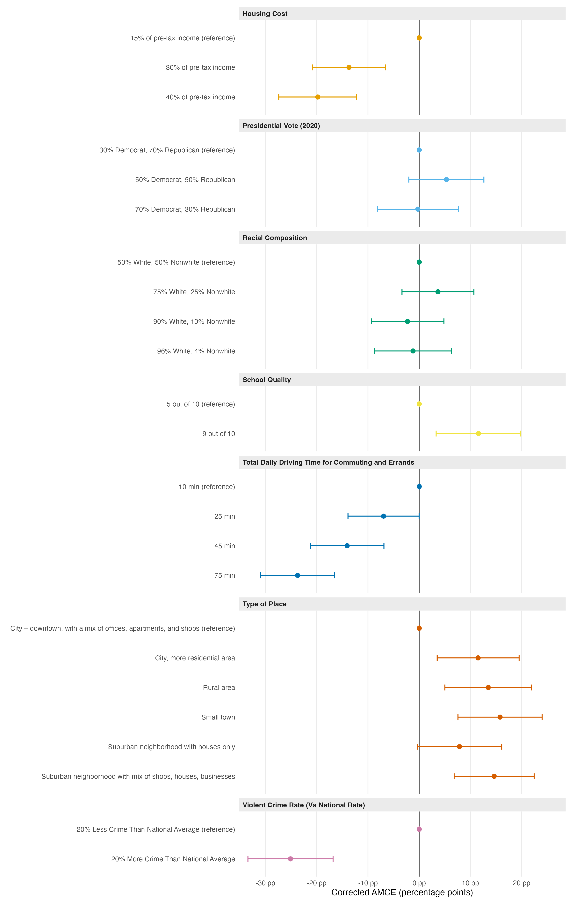

Using the conjoint profiles, we estimated corrected average marginal component effects (AMCEs) on profile choice, with each level interpreted relative to the first-listed level of its attribute. The correction uses the repeated task to account for imperfect intra-respondent reliability (estimated tau = 0.172). The clearest negative response was to a violent-crime rate 20% above the national average: it reduced the probability of choosing a profile by 25.1 percentage points relative to a rate 20% below the national average. Longer daily travel also mattered substantially. A 75-minute commute reduced choice by 23.7 percentage points relative to 10 minutes, while housing costs equal to 40% of pre-tax income reduced choice by 19.8 points relative to 15%. Place type generated the largest positive shifts: a small town increased choice by 15.8 points and a suburban neighborhood mixing shops, houses, and businesses increased it by 14.6 points, each compared with a downtown city setting with mixed offices, apartments, and shops. Several remaining attribute-level contrasts were substantively more modest. The 95% intervals use respondent-clustered analytical standard errors; intervals for many of these smaller contrasts crossed zero.

Corrected AMCEs on profile choice relative to the first-listed level of each attribute; dots are estimates and whiskers are respondent-clustered 95% intervals.
