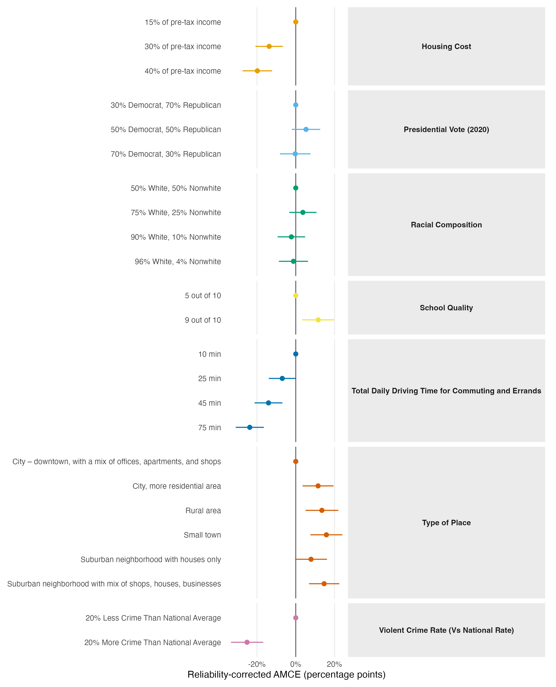

Using profile-level AMCE estimation, the conjoint results show that several community features strongly shifted the probability that a profile was chosen. All estimates use the repeated flipped task for reliability correction and analytical uncertainty clustered by respondent ID. Relative to 20% less crime than the national average, a community with 20% more crime reduced choice by 25.1 percentage points. Relative to a 10-minute daily driving time, 75 minutes reduced choice by 23.7 points, and relative to housing costs of 15% of pre-tax income, costs of 40% reduced choice by 19.8 points. Place type also mattered: relative to a downtown mixed-use city, a small town increased choice by 15.8 points and a suburban neighborhood mixing shops, houses, and businesses increased it by 14.6 points. Better schools were favored: a rating of 9 rather than 5 out of 10 increased choice by 11.6 points. The 95% confidence intervals exclude zero for the largest negative effects (more crime: -33.4 to -16.8 points; 75-minute driving: -31.0 to -16.5), while several smaller attribute-level contrasts remain imprecise. Intervals use Stata-style respondent-clustered standard errors, specified directly because the default CR2 covariance was non-PSD for some contrasts.

*Figure 1. Reliability-corrected profile-level AMCEs with 95% confidence intervals clustered by respondent; first-listed attribute levels are zero-valued references.*
