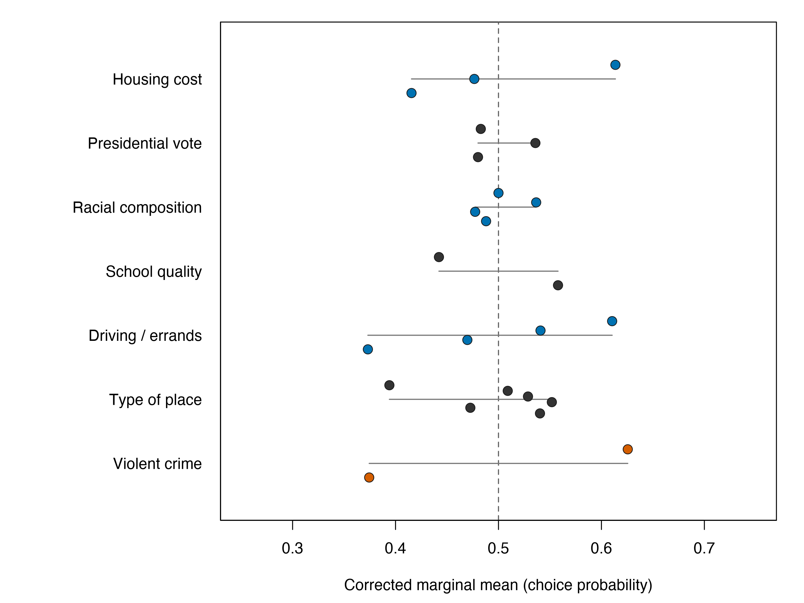

# Response to reviewer

Thank you for identifying a real limitation in how we described the AMCE results. AMCE coefficients are parameterized comparisons: changing a reference category changes the displayed coefficient, so a headline framed as a single baseline-specific coefficient is too strong. That mechanical dependence does not make reference categories meaningless, but it does require that the comparison and its direction be explicit.

For Violent Crime Rate, the data give a particularly simple sensitivity result because the attribute is binary (as is School Quality). With 20% less crime as the baseline, moving to 20% more crime has a corrected AMCE of -25.1 pp (95% CI -33.4, -16.8). Reversing the baseline gives 25.1 pp (95% CI 16.8, 33.4). These are the same randomized comparison with the direction reversed; there is no third crime contrast whose magnitude could alter the result. The associated corrected marginal means are 0.626 (95% CI 0.584, 0.667) for 20% less crime and 0.374 (95% CI 0.333, 0.416) for 20% more crime. Their difference is the same 25.1 percentage points.

The reviewer is nevertheless right that multi-level attributes have more baseline-dependent AMCE displays. For Housing Cost, 30% rather than 15% of pre-tax income has a corrected contrast of -13.7 pp (95% CI -20.8, -6.6) when 15% is the baseline. Expressing the comparison with 40% as the baseline, 15% rather than 40% has a corrected contrast of 19.8 pp (95% CI 12.2, 27.4). Those are useful, different parameterizations of different level comparisons, not a basis for ranking a single coefficient across arbitrary baselines.

We therefore also compare corrected marginal means for all 24 attribute levels, which do not require a reference category. Crime spans 25.1 percentage points across its two levels, the largest observed point-estimate spread, but it is close to commuting's 23.7 points. This evidence does not establish a uniquely dominant attribute ranking. In revision, we will say that moving from 20% less to 20% more crime causes a substantial reduction in choice probability in this randomized conjoint, and that crime is among the strongest attributes (and has the largest observed marginal-mean spread). We will not say that it uniquely drives choice.

*Figure 1. Corrected marginal means are baseline-invariant; each point is a level and each thin segment is that attribute's minimum-to-maximum range. Color supplements the labeled attribute position rather than serving as the sole identifier.*

