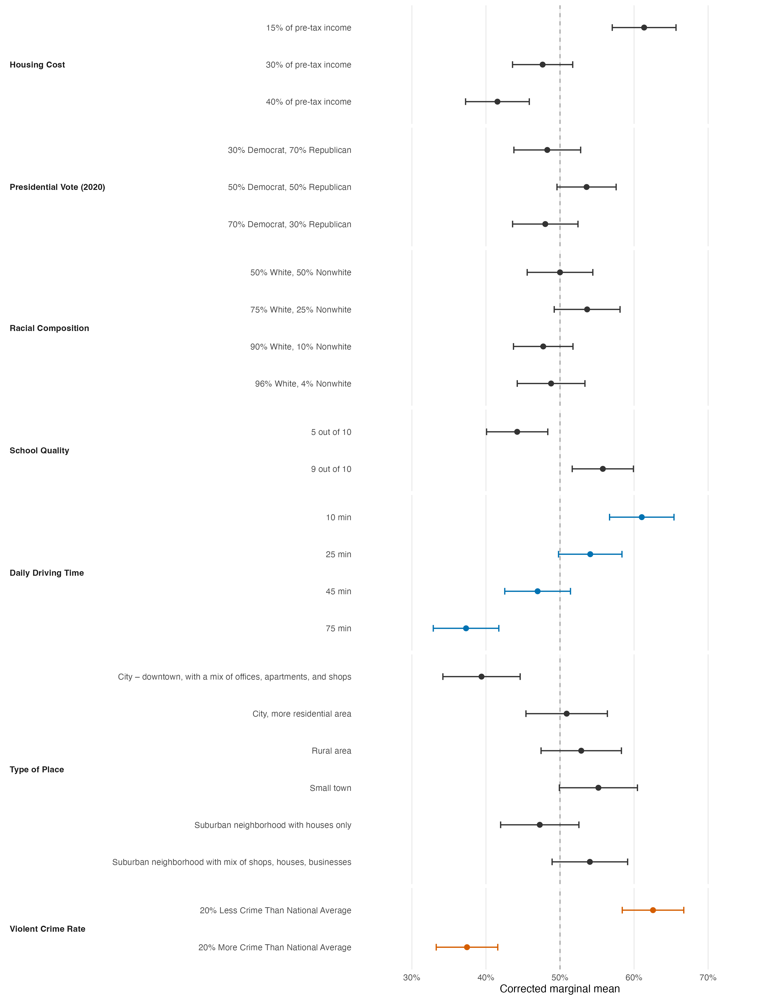

# Response to the reviewer

The reviewer is mechanically correct that an AMCE is a contrast against an omitted reference level. Changing that level changes which coefficient is zero, can reverse signs, and, for a multi-level attribute, changes the magnitudes of the reported coefficients. Driving time illustrates the point: the largest absolute corrected AMCE is 23.7 percentage points when either endpoint (10 or 75 minutes) is the reference, but 16.8 points with 25 minutes as the reference and 14.1 points with 45 minutes as the reference. A ranking based on the largest displayed AMCE coefficient is therefore not a defensible measure of attribute importance.

That mechanical concern does not overturn the violent-crime result in these data. Crime is binary, so there is only one nonredundant contrast. With “20% Less Crime Than National Average” as the reference, the corrected AMCE for “20% More Crime” is −25.1 points (95% CI: −33.4, −16.8). Reversing the reference produces +25.1 points (95% CI: 16.8, 33.4). Releveling changes the direction in which the same comparison is written, not its size or uncertainty.

Marginal means provide the cleaner, baseline-invariant comparison. The corrected probability of selection is 62.6% (95% CI: 58.4%, 66.7%) for the lower-crime level and 37.4% (95% CI: 33.3%, 41.6%) for the higher-crime level, a 25.1-point observed spread. This is the largest MM spread among the seven attributes, but only narrowly: driving time spans 23.7 points and housing cost 19.8 points. The uncorrected estimates preserve the same ordering—16.5, 15.6, and 13.0 points, respectively—so the ranking is not created by the reliability correction. Still, these are descriptive range comparisons, not a formal test that crime’s range exceeds driving time’s, and the experimentally chosen level ranges differ across attributes.

We will therefore replace the claim that violent crime “drives” community choice with the following: **Within the levels randomized in this experiment, violent crime produced a large preference shift and had the largest observed marginal-mean spread, narrowly ahead of driving time; it is one of the strongest attributes in this design.** We will report MMs as the primary evidence, retain AMCEs as explicitly labeled pairwise contrasts, and avoid claiming unique or universal dominance.

*Figure 1. Corrected profile-level marginal means with 95% confidence intervals. The dashed line marks 0.50; crime is highlighted in vermillion and driving time in blue.*
