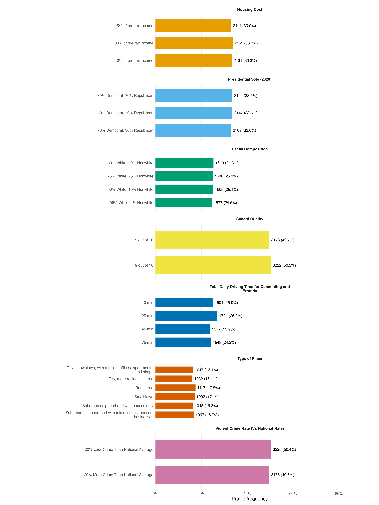

# Conjoint design summary

## Design

- Respondents: 400
- Primary choice tasks per respondent: 8
- Repeated reliability task: 1 (a flipped repeat of choice task 1)
- Total presented choice tasks per respondent: 9
- Profiles per task: 2
- Analysis rows: 6,400 profile-task observations (400 × 8 × 2)

## Attributes and levels

| Attribute ID | Attribute | Levels |
|---|---|---:|
| att1 | Housing Cost | 3 |
| att2 | Presidential Vote (2020) | 3 |
| att3 | Racial Composition | 4 |
| att4 | School Quality | 2 |
| att5 | Total Daily Driving Time for Commuting and Errands | 4 |
| att6 | Type of Place | 6 |
| att7 | Violent Crime Rate (Vs National Rate) | 2 |

## Randomization balance

Level frequencies are calculated across all 6,400 displayed profiles (the eight primary tasks); percentages are within attribute.

| Attribute | Level | n | % |
|---|---|---:|---:|
| Housing Cost | 15% of pre-tax income | 2114 | 33.0% |
| Housing Cost | 30% of pre-tax income | 2155 | 33.7% |
| Housing Cost | 40% of pre-tax income | 2131 | 33.3% |
| Presidential Vote (2020) | 30% Democrat, 70% Republican | 2144 | 33.5% |
| Presidential Vote (2020) | 50% Democrat, 50% Republican | 2147 | 33.5% |
| Presidential Vote (2020) | 70% Democrat, 30% Republican | 2109 | 33.0% |
| Racial Composition | 50% White, 50% Nonwhite | 1618 | 25.3% |
| Racial Composition | 75% White, 25% Nonwhite | 1600 | 25.0% |
| Racial Composition | 90% White, 10% Nonwhite | 1605 | 25.1% |
| Racial Composition | 96% White, 4% Nonwhite | 1577 | 24.6% |
| School Quality | 5 out of 10 | 3178 | 49.7% |
| School Quality | 9 out of 10 | 3222 | 50.3% |
| Total Daily Driving Time for Commuting and Errands | 10 min | 1601 | 25.0% |
| Total Daily Driving Time for Commuting and Errands | 25 min | 1724 | 26.9% |
| Total Daily Driving Time for Commuting and Errands | 45 min | 1527 | 23.9% |
| Total Daily Driving Time for Commuting and Errands | 75 min | 1548 | 24.2% |
| Type of Place | City – downtown, with a mix of offices, apartments, and shops | 1047 | 16.4% |
| Type of Place | City, more residential area | 1032 | 16.1% |
| Type of Place | Rural area | 1117 | 17.5% |
| Type of Place | Small town | 1092 | 17.1% |
| Type of Place | Suburban neighborhood with houses only | 1045 | 16.3% |
| Type of Place | Suburban neighborhood with mix of shops, houses, businesses | 1067 | 16.7% |
| Violent Crime Rate (Vs National Rate) | 20% Less Crime Than National Average | 3225 | 50.4% |
| Violent Crime Rate (Vs National Rate) | 20% More Crime Than National Average | 3175 | 49.6% |

## Figure

**Caption.** Within each attribute, level assignment is close to even across the 6,400 displayed profiles, as expected under randomized profile construction.

