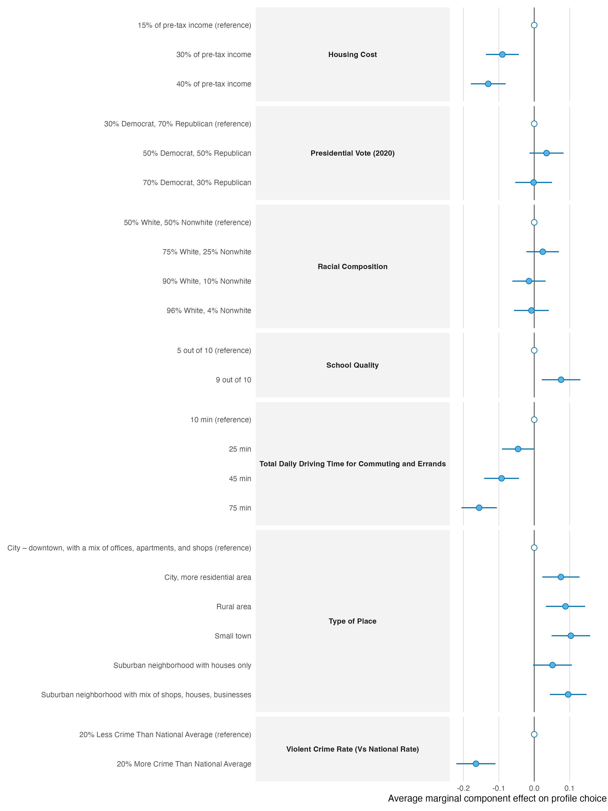

Using conventional profile-level AMCEs estimated with `projoint`, Figure 1 shows clear preferences over several neighborhood attributes. Relative to a housing cost of 15% of pre-tax income, a cost of 40% reduced the probability that a profile was chosen by 13.0 percentage points (pp; 95% CI: -17.9 to -8.1), while a cost of 30% reduced it by 9.0 pp (-13.6 to -4.3). The largest estimated penalty was for a violent-crime rate 20% above the national average rather than 20% below it: -16.5 pp (-22.0 to -10.9). Commuting time also mattered substantially. Compared with 10 minutes of daily driving, 75 minutes lowered profile choice by 15.6 pp (-20.5 to -10.6), and 45 minutes lowered it by 9.2 pp (-14.1 to -4.3). School quality was consequential in the opposite direction: a rating of 9 rather than 5 out of 10 increased choice by 7.6 pp (2.2 to 13.0). Several place types were preferred to a downtown mixed-use city setting, including a small town (+10.3 pp; 4.9 to 15.8) and a rural area (+8.8 pp; 3.3 to 14.4). The presidential-vote and racial-composition contrasts were smaller, and their intervals included zero. The 95% intervals use respondent-clustered standard errors, accounting for the multiple profiles evaluated by each person and showing that the principal cost, commute, crime, school-quality, and place-type effects are estimated with appreciable precision.

*Figure 1. Average marginal component effects (AMCEs) on the probability that a profile is chosen. Points are conventional estimates and whiskers are respondent-clustered 95% confidence intervals; reference levels are plotted at zero.*
