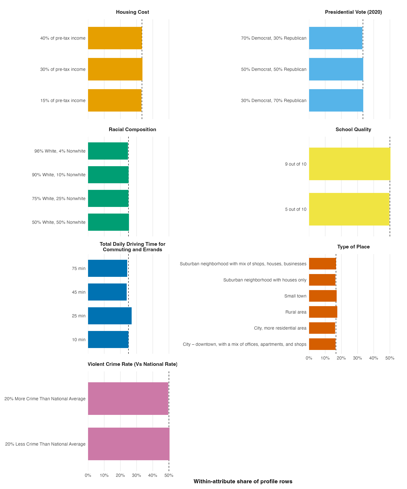

# Community-choice conjoint: design summary

## Design

- **Respondents:** 400
- **Randomized choice tasks per respondent:** 8 (plus one repeated, flipped version of task 1 for reliability checking)
- **Profiles per randomized task:** 2
- **Analysis-ready profile rows:** 6,400
- **Validation:** Every `id × task × profile` combination appears exactly once.

## Attributes

| Attribute | Number of levels |
|:--|--:|
| Housing Cost | 3 |
| Presidential Vote (2020) | 3 |
| Racial Composition | 4 |
| School Quality | 2 |
| Total Daily Driving Time for Commuting and Errands | 4 |
| Type of Place | 6 |
| Violent Crime Rate (Vs National Rate) | 2 |

## Randomization balance

The table gives each level's within-attribute share of the 6,400 profile rows; the equal-allocation target is shown as the exact fraction `1/L` alongside its rounded percentage.
The largest departure from equal allocation was 1.9 percentage points (25-minute driving time), indicating generally good randomization balance.

| Attribute | Level | Frequency | Observed share | Equal-allocation target | Difference |
|:--|:--|--:|--:|--:|--:|
| Housing Cost | 15% of pre-tax income | 2,114 | 33.0% | 33.3% (1/3) | -0.3 pp |
| Housing Cost | 30% of pre-tax income | 2,155 | 33.7% | 33.3% (1/3) | +0.3 pp |
| Housing Cost | 40% of pre-tax income | 2,131 | 33.3% | 33.3% (1/3) | 0.0 pp |
| Presidential Vote (2020) | 30% Democrat, 70% Republican | 2,144 | 33.5% | 33.3% (1/3) | +0.2 pp |
| Presidential Vote (2020) | 50% Democrat, 50% Republican | 2,147 | 33.5% | 33.3% (1/3) | +0.2 pp |
| Presidential Vote (2020) | 70% Democrat, 30% Republican | 2,109 | 33.0% | 33.3% (1/3) | -0.4 pp |
| Racial Composition | 50% White, 50% Nonwhite | 1,618 | 25.3% | 25.0% (1/4) | +0.3 pp |
| Racial Composition | 75% White, 25% Nonwhite | 1,600 | 25.0% | 25.0% (1/4) | 0.0 pp |
| Racial Composition | 90% White, 10% Nonwhite | 1,605 | 25.1% | 25.0% (1/4) | +0.1 pp |
| Racial Composition | 96% White, 4% Nonwhite | 1,577 | 24.6% | 25.0% (1/4) | -0.4 pp |
| School Quality | 5 out of 10 | 3,178 | 49.7% | 50.0% (1/2) | -0.3 pp |
| School Quality | 9 out of 10 | 3,222 | 50.3% | 50.0% (1/2) | +0.3 pp |
| Total Daily Driving Time for Commuting and Errands | 10 min | 1,601 | 25.0% | 25.0% (1/4) | 0.0 pp |
| Total Daily Driving Time for Commuting and Errands | 25 min | 1,724 | 26.9% | 25.0% (1/4) | +1.9 pp |
| Total Daily Driving Time for Commuting and Errands | 45 min | 1,527 | 23.9% | 25.0% (1/4) | -1.1 pp |
| Total Daily Driving Time for Commuting and Errands | 75 min | 1,548 | 24.2% | 25.0% (1/4) | -0.8 pp |
| Type of Place | City – downtown, with a mix of offices, apartments, and shops | 1,047 | 16.4% | 16.7% (1/6) | -0.3 pp |
| Type of Place | City, more residential area | 1,032 | 16.1% | 16.7% (1/6) | -0.5 pp |
| Type of Place | Rural area | 1,117 | 17.5% | 16.7% (1/6) | +0.8 pp |
| Type of Place | Small town | 1,092 | 17.1% | 16.7% (1/6) | +0.4 pp |
| Type of Place | Suburban neighborhood with houses only | 1,045 | 16.3% | 16.7% (1/6) | -0.3 pp |
| Type of Place | Suburban neighborhood with mix of shops, houses, businesses | 1,067 | 16.7% | 16.7% (1/6) | 0.0 pp |
| Violent Crime Rate (Vs National Rate) | 20% Less Crime Than National Average | 3,225 | 50.4% | 50.0% (1/2) | +0.4 pp |
| Violent Crime Rate (Vs National Rate) | 20% More Crime Than National Average | 3,175 | 49.6% | 50.0% (1/2) | -0.4 pp |

*Figure 1. Within-attribute level shares; dashed vertical lines mark the equal-allocation target of `1/L` for each attribute.*
