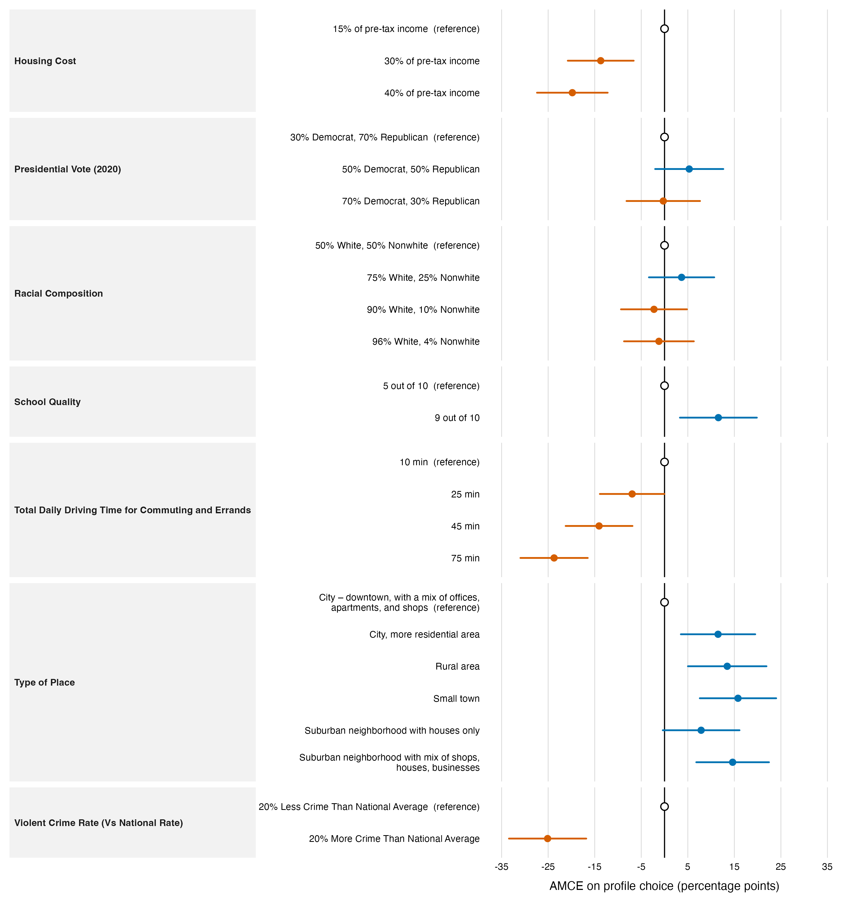

=== ORIGINAL BRIEF ===
# Task T2 — Estimate and report (standard tier)

You are working in a project directory. Use R (`Rscript`); the `projoint` package is installed.

**Data.** Same as T1:

```r
library(projoint)
data(exampleData1)
out <- reshape_projoint(exampleData1,
  .outcomes = c(paste0("choice", 1:8), "choice1_repeated_flipped"))
```

**Task.** Estimate Average Marginal Component Effects (AMCEs) for all seven attributes on profile choice, with uncertainty clustered at the respondent level. Use projoint's estimator, or an explicit alternative with a one-line justification if you deviate.

**Produce, in the current working directory:**

1. `script.R` — one self-contained script; Okabe-Ito palette and theme declared at the top; `set.seed()` before anything stochastic.
2. `figures/amce-dotwhisker.png` — a dot-and-whisker plot of the AMCE estimates with 95% intervals, grouped by attribute, levels ordered within attribute, reference levels shown at zero. 300+ dpi. No in-plot title.
3. `report.md` — a results paragraph of roughly 200 words that a paper could use: the largest effects, their direction and magnitude in percentage points, and one sentence on uncertainty. Place the figure's caption under the figure reference.

**Constraints.** At most one revision cycle. If your mode delegates, use at most 3 delegations. No web access. Do not install packages.

=== PRODUCED DELIVERABLES ===
--- report.md ---
# AMCE estimates



*Figure 1. Measurement-error-corrected profile-level AMCEs on choice probability, estimated with `projoint` from 400 respondents (3,200 paired choices; 6,400 profile records). Points are estimates and whiskers are 95% confidence intervals from respondent-clustered analytical standard errors. Within each attribute, the first listed level is the zero-valued reference category.*

## Results

The corrected profile-level AMCEs show that respondents strongly preferred profiles in lower-crime, lower-cost, and lower-travel-time communities. Relative to a community with 20% less crime than the national average, one with 20% more crime reduced the probability of profile choice by 25.1 percentage points (95% CI [-33.4, -16.8]). A 75-minute daily driving time, rather than 10 minutes, reduced choice by 23.7 points (95% CI [-31.0, -16.5]), and housing costs of 40% rather than 15% of pre-tax income reduced it by 19.8 points (95% CI [-27.4, -12.2]). The corresponding penalties were also substantial for 45 minutes of daily driving (14.1 points) and 30% housing costs (13.7 points). Place characteristics produced the largest positive effects: compared with a downtown city reference, a small town increased choice by 15.8 points, a mixed-use suburb by 14.6 points, and a rural area by 13.5 points. A school-quality rating of 9 rather than 5 out of 10 increased choice by 11.6 points. Effects for presidential vote and racial composition were comparatively small, with intervals that included zero. Uncertainty is represented by 95% confidence intervals calculated from respondent-clustered standard errors, which account for repeated profile evaluations by the same respondent.

--- script.R ---
# Reproducibility and figure design ------------------------------------------------
set.seed(20260719L)

library(projoint)
library(dplyr)
library(ggplot2)
library(stringr)
library(scales)

# Okabe-Ito colour-blind-safe palette.
okabe_ito <- c(
  orange = "#E69F00", sky_blue = "#56B4E9", bluish_green = "#009E73",
  yellow = "#F0E442", blue = "#0072B2", vermillion = "#D55E00",
  reddish_purple = "#CC79A7", black = "#000000", grey = "#999999"
)

theme_amce <- theme_minimal(base_size = 10, base_family = "sans") +
  theme(
    panel.grid.major.y = element_blank(),
    panel.grid.minor = element_blank(),
    panel.grid.major.x = element_line(colour = "#D9D9D9", linewidth = 0.3),
    strip.background = element_rect(fill = "#F2F2F2", colour = NA),
    strip.text.y.left = element_text(face = "bold", angle = 0, hjust = 0),
    strip.placement = "outside",
    axis.title.y = element_blank(),
    axis.text.y = element_text(size = 8, colour = okabe_ito[["black"]]),
    axis.text.x = element_text(colour = okabe_ito[["black"]]),
    axis.title.x = element_text(margin = margin(t = 8)),
    plot.margin = margin(8, 12, 8, 8)
  )

# Data and estimation --------------------------------------------------------------
data(exampleData1)
out <- reshape_projoint(
  exampleData1,
  .outcomes = c(paste0("choice", 1:8), "choice1_repeated_flipped")
)

# `projoint` estimates measurement-error-corrected AMCEs using the repeated,
# flipped task. `stata` supplies respondent-clustered analytical standard errors.
amce_fit <- suppressWarnings(projoint(
  out,
  .structure = "profile_level",
  .estimand = "amce",
  .se_method = "analytical",
  .clusters_1 = id,
  .se_type_1 = "stata",
  .clusters_2 = id,
  .se_type_2 = "stata"
))

if (!identical(amce_fit$cluster_by, "id")) {
  stop("AMCE uncertainty was not clustered at the respondent level.")
}

# Plot data: the first displayed level of each attribute is the AMCE reference.
estimate_data <- amce_fit$estimates |>
  filter(estimand == "amce_corrected") |>
  transmute(
    level_id = att_level_choose,
    estimate, se, conf.low, conf.high,
    is_reference = FALSE
  )

plot_data <- out$labels |>
  arrange(attribute_id, level_id) |>
  left_join(estimate_data, by = "level_id") |>
  mutate(
    is_reference = grepl(":level1$", level_id),
    estimate = if_else(is_reference, 0, estimate),
    se = if_else(is_reference, 0, se),
    conf.low = if_else(is_reference, 0, conf.low),
    conf.high = if_else(is_reference, 0, conf.high),
    attribute = factor(attribute, levels = unique(attribute)),
    level_key = paste(attribute_id, level_id, sep = "::"),
    level_label = paste0(
      str_wrap(level, width = 43),
      if_else(is_reference, "  (reference)", "")
    ),
    estimate_pp = 100 * estimate,
    lower_pp = 100 * conf.low,
    upper_pp = 100 * conf.high,
    direction = if_else(estimate >= 0, "Positive AMCE", "Negative AMCE")
  )

level_keys <- plot_data$level_key
level_labels <- setNames(plot_data$level_label, level_keys)
plot_data <- plot_data |>
  mutate(level_key = factor(level_key, levels = rev(level_keys)))

effect_limit <- max(35, ceiling(max(abs(c(plot_data$lower_pp, plot_data$upper_pp))) / 5) * 5)

# Figure: horizontal coefficient plot, faceted by attribute.
amce_plot <- ggplot(plot_data, aes(y = level_key)) +
  geom_vline(xintercept = 0, colour = okabe_ito[["black"]], linewidth = 0.45) +
  geom_segment(
    data = filter(plot_data, !is_reference),
    aes(x = lower_pp, xend = upper_pp, yend = level_key, colour = direction),
    linewidth = 0.7, lineend = "round"
  ) +
  geom_point(
    data = filter(plot_data, !is_reference),
    aes(x = estimate_pp, colour = direction),
    size = 2.25
  ) +
  geom_point(
    data = filter(plot_data, is_reference),
    aes(x = estimate_pp),
    shape = 21, size = 2.5, stroke = 0.7,
    colour = okabe_ito[["black"]], fill = "white"
  ) +
  facet_grid(
    rows = vars(attribute), scales = "free_y", space = "free_y", switch = "y"
  ) +
  scale_colour_manual(
    values = c(
      "Negative AMCE" = okabe_ito[["vermillion"]],
      "Positive AMCE" = okabe_ito[["blue"]]
    ),
    guide = "none"
  ) +
  scale_x_continuous(
    name = "AMCE on profile choice (percentage points)",
    breaks = seq(-effect_limit, effect_limit, by = 10),
    labels = label_number(accuracy = 1)
  ) +
  scale_y_discrete(labels = level_labels, drop = TRUE) +
  coord_cartesian(xlim = c(-effect_limit, effect_limit), clip = "off") +
  theme_amce

dir.create("figures", showWarnings = FALSE, recursive = TRUE)
ggsave(
  filename = "figures/amce-dotwhisker.png", plot = amce_plot,
  width = 10, height = 10.5, units = "in", dpi = 320, bg = "white"
)

# Results report -------------------------------------------------------------------
effect <- function(target_level_id) {
  result <- filter(plot_data, .data$level_id == target_level_id)
  if (nrow(result) != 1) stop("Expected exactly one AMCE result for ", target_level_id)
  result
}
pp <- function(x) sprintf("%.1f", 100 * x)
pp_abs <- function(x) sprintf("%.1f", abs(100 * x))

crime_more <- effect("att7:level2")
drive_75 <- effect("att5:level4")
housing_40 <- effect("att1:level3")
drive_45 <- effect("att5:level3")
housing_30 <- effect("att1:level2")
small_town <- effect("att6:level4")
suburb_mixed <- effect("att6:level6")
rural <- effect("att6:level3")
school_9 <- effect("att4:level2")

n_respondents <- n_distinct(out$data$id)
n_profiles <- nrow(out$data)
n_choices <- n_profiles / 2

report_lines <- c(
  "# AMCE estimates",
  "",
  "",
  "",
  sprintf(
    "*Figure 1. Measurement-error-corrected profile-level AMCEs on choice probability, estimated with `projoint` from %s respondents (%s paired choices; %s profile records). Points are estimates and whiskers are 95%% confidence intervals from respondent-clustered analytical standard errors. Within each attribute, the first listed level is the zero-valued reference category.*",
    comma(n_respondents), comma(n_choices), comma(n_profiles)
  ),
  "",
  "## Results",
  "",
  sprintf(
    paste0(
      "The corrected profile-level AMCEs show that respondents strongly preferred profiles in lower-crime, lower-cost, and lower-travel-time communities. ",
      "Relative to a community with 20%% less crime than the national average, one with 20%% more crime reduced the probability of profile choice by %s percentage points (95%% CI [%s, %s]). ",
      "A 75-minute daily driving time, rather than 10 minutes, reduced choice by %s points (95%% CI [%s, %s]), and housing costs of 40%% rather than 15%% of pre-tax income reduced it by %s points (95%% CI [%s, %s]). ",
      "The corresponding penalties were also substantial for 45 minutes of daily driving (%s points) and 30%% housing costs (%s points). ",
      "Place characteristics produced the largest positive effects: compared with a downtown city reference, a small town increased choice by %s points, a mixed-use suburb by %s points, and a rural area by %s points. ",
      "A school-quality rating of 9 rather than 5 out of 10 increased choice by %s points. ",
      "Effects for presidential vote and racial composition were comparatively small, with intervals that included zero. ",
      "Uncertainty is represented by 95%% confidence intervals calculated from respondent-clustered standard errors, which account for repeated profile evaluations by the same respondent."
    ),
    pp_abs(crime_more$estimate), pp(crime_more$conf.low), pp(crime_more$conf.high),
    pp_abs(drive_75$estimate), pp(drive_75$conf.low), pp(drive_75$conf.high),
    pp_abs(housing_40$estimate), pp(housing_40$conf.low), pp(housing_40$conf.high),
    pp_abs(drive_45$estimate), pp_abs(housing_30$estimate),
    pp(small_town$estimate), pp(suburb_mixed$estimate), pp(rural$estimate),
    pp(school_9$estimate)
  )
)

writeLines(report_lines, "report.md")

message("Wrote figures/amce-dotwhisker.png and report.md")

=== QUESTION ===
This is a completed submission against the brief above. What would you change?
