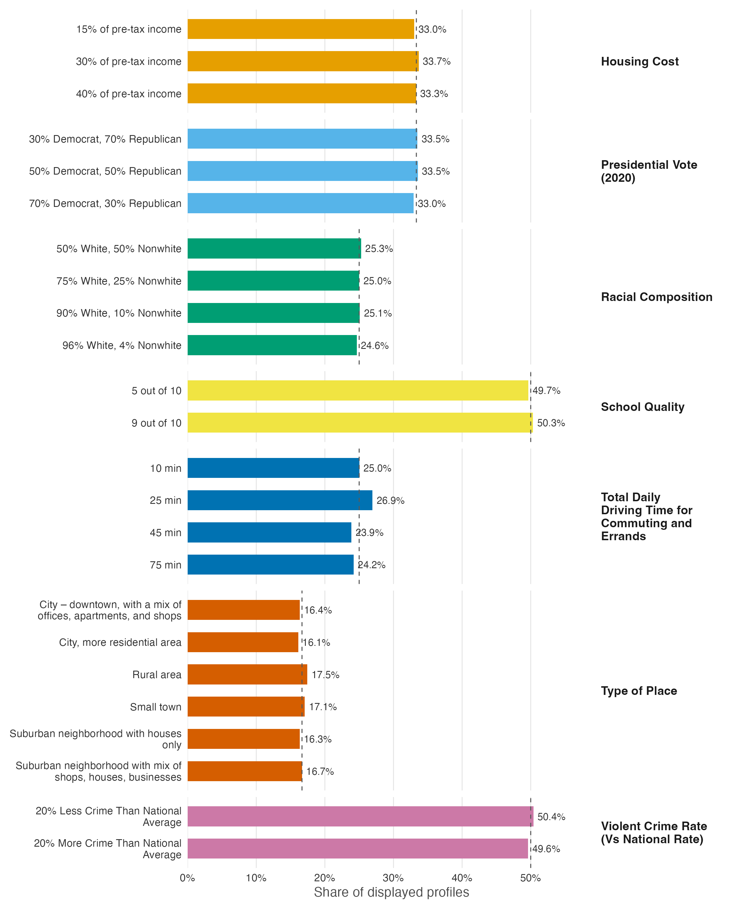

# Design summary: `projoint::exampleData1` (community-choice conjoint)

## Structure

- **Respondents:** 400
- **Choice tasks per respondent:** 8, plus one repeated task (`choice1_repeated_flipped`: task 1 re-shown with the two profiles in flipped order, used for intra-respondent reliability / IRR correction)
- **Profiles per task:** 2 (forced binary choice)
- **Profile observations:** 6,400 (400 respondents x 8 tasks x 2 profiles). The repeated task adds no rows: its outcome is stored in the `selected_repeated` column of the task-1 rows.
- **Attributes:** 7, with 24 levels in total
- **Repeated-task agreement:** 286 of 400 respondents (71.5%) made the same choice on task 1 as on its flipped repeat (`agree` == 1) -- the reliability check the repeated task is designed to produce.

## Attributes and level counts

| Attribute id | Attribute | Levels |
|---|---|---|
| att1 | Housing Cost | 3 |
| att2 | Presidential Vote (2020) | 3 |
| att3 | Racial Composition | 4 |
| att4 | School Quality | 2 |
| att5 | Total Daily Driving Time for Commuting and Errands | 4 |
| att6 | Type of Place | 6 |
| att7 | Violent Crime Rate (Vs National Rate) | 2 |

## Randomization balance check

Frequencies of each level across all displayed profiles, within attribute.
Observed frequencies are compared to a uniform benchmark (each level shown
with probability 1 / number of levels); the design's true assignment
probabilities are not documented here, so a departure from the benchmark is
a flag to interpret, not automatically an error. The tests treat the
6,400
displayed profiles as independent draws, which is appropriate under
per-profile randomization.

| Attribute | Level | Shown (n) | Share |
|---|---|---|---|
| Housing Cost | 15% of pre-tax income | 2,114 | 33.0% |
| Housing Cost | 30% of pre-tax income | 2,155 | 33.7% |
| Housing Cost | 40% of pre-tax income | 2,131 | 33.3% |
| Presidential Vote (2020) | 30% Democrat, 70% Republican | 2,144 | 33.5% |
| Presidential Vote (2020) | 50% Democrat, 50% Republican | 2,147 | 33.5% |
| Presidential Vote (2020) | 70% Democrat, 30% Republican | 2,109 | 33.0% |
| Racial Composition | 50% White, 50% Nonwhite | 1,618 | 25.3% |
| Racial Composition | 75% White, 25% Nonwhite | 1,600 | 25.0% |
| Racial Composition | 90% White, 10% Nonwhite | 1,605 | 25.1% |
| Racial Composition | 96% White, 4% Nonwhite | 1,577 | 24.6% |
| School Quality | 5 out of 10 | 3,178 | 49.7% |
| School Quality | 9 out of 10 | 3,222 | 50.3% |
| Total Daily Driving Time for Commuting and Errands | 10 min | 1,601 | 25.0% |
| Total Daily Driving Time for Commuting and Errands | 25 min | 1,724 | 26.9% |
| Total Daily Driving Time for Commuting and Errands | 45 min | 1,527 | 23.9% |
| Total Daily Driving Time for Commuting and Errands | 75 min | 1,548 | 24.2% |
| Type of Place | City – downtown, with a mix of offices, apartments, and shops | 1,047 | 16.4% |
| Type of Place | City, more residential area | 1,032 | 16.1% |
| Type of Place | Rural area | 1,117 | 17.5% |
| Type of Place | Small town | 1,092 | 17.1% |
| Type of Place | Suburban neighborhood with houses only | 1,045 | 16.3% |
| Type of Place | Suburban neighborhood with mix of shops, houses, businesses | 1,067 | 16.7% |
| Violent Crime Rate (Vs National Rate) | 20% Less Crime Than National Average | 3,225 | 50.4% |
| Violent Crime Rate (Vs National Rate) | 20% More Crime Than National Average | 3,175 | 49.6% |

Chi-squared goodness-of-fit tests against the uniform benchmark:

| Attribute | Levels | Chi-sq | p-value | Max relative deviation |
|---|---|---|---|---|
| Housing Cost | 3 | 0.40 | 0.820 | 1.0% |
| Presidential Vote (2020) | 3 | 0.42 | 0.811 | 1.1% |
| Racial Composition | 4 | 0.55 | 0.908 | 1.4% |
| School Quality | 2 | 0.30 | 0.582 | 0.7% |
| Total Daily Driving Time for Commuting and Errands | 4 | 14.63 | 0.002 | 7.8% |
| Type of Place | 6 | 4.91 | 0.427 | 4.7% |
| Violent Crime Rate (Vs National Rate) | 2 | 0.39 | 0.532 | 0.8% |

Total Daily Driving Time for Commuting and Errands departs from the uniform benchmark (p = 0.002, which survives a Bonferroni correction across the 7 tests). Because the true assignment probabilities are not documented here, this flags a departure from uniformity, not necessarily an error: weighted or restricted randomization would produce the same pattern. A sweep of all 21 pairwise cross-tabulations among the 7 attributes finds no dependence surviving any multiplicity correction (smallest unadjusted p = 0.022, for School Quality x Violent Crime Rate (Vs National Rate); every pair involving Total Daily Driving Time for Commuting and Errands has p >= 0.13), so the departure is confined to Total Daily Driving Time for Commuting and Errands's own margins. The imbalance remains an open flag (weighted assignment or chance) rather than evidence of a data problem.

## Figure

*Share of the 6,400 displayed profiles assigned to each level of each attribute, with dashed lines marking the uniform benchmark (1 / number of levels); only Total Daily Driving Time for Commuting and Errands departs detectably from it (chi-squared p = 0.002).*
