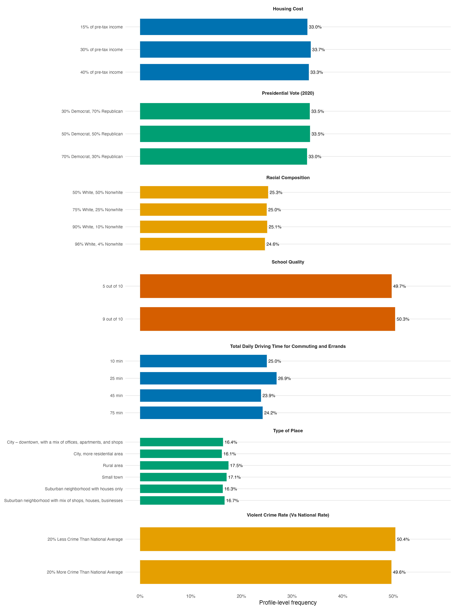

=== ORIGINAL BRIEF ===
# Task T1 — Describe the design (mechanical tier)

You are working in a project directory. Use R (`Rscript`) for all analysis; the `projoint` package is installed.

**Data.** The `projoint` R package's built-in `exampleData1`: a wide-format Qualtrics export from a community-choice conjoint — 400 respondents, 8 choice tasks, 2 profiles per task, 7 attributes, plus one repeated task for reliability checks. Load and reshape:

```r
library(projoint)
data(exampleData1)
out <- reshape_projoint(exampleData1,
  .outcomes = c(paste0("choice", 1:8), "choice1_repeated_flipped"))
```

`out$data` is the analysis-ready long format; `out$labels` maps attribute ids (`att1`…`att7`) to their human-readable names and levels.

**Produce, in the current working directory:**

1. `script.R` — one self-contained script that does everything below. Declare the plotting theme and an Okabe-Ito palette at the top. `set.seed()` before anything stochastic.
2. `summary.md` — a tidy design summary: respondents, tasks per respondent, profiles per task, the seven attributes with their level counts (human-readable names from `out$labels`), and a randomization balance check (level frequencies within each attribute).
3. `figures/level-frequencies.png` — ONE descriptive figure of attribute-level frequencies, 300+ dpi. No in-plot title: the figure's one-sentence caption goes under the figure reference in `summary.md`.

**Constraints.** At most one revision cycle. If your mode delegates, use at most 3 delegations. Do not fetch anything from the web. Do not install packages.

=== PRODUCED DELIVERABLES ===
--- summary.md ---
# Community-choice conjoint: design summary

## Design

| Component | Value |
|---|---:|
| Respondents | 400 |
| Choice tasks per respondent | 8 |
| Profiles per task | 2 |
| Profile rows used for balance checks | 6400 |

The reshaped data contain the eight original choice tasks. The repeated, flipped first task is available as a separate repeated-choice outcome and is not counted as a ninth randomized task.

## Attributes and levels

| ID | Attribute | Levels |
|---|---|---:|
| `att1` | Housing Cost | 3 |
| `att2` | Presidential Vote (2020) | 3 |
| `att3` | Racial Composition | 4 |
| `att4` | School Quality | 2 |
| `att5` | Total Daily Driving Time for Commuting and Errands | 4 |
| `att6` | Type of Place | 6 |
| `att7` | Violent Crime Rate (Vs National Rate) | 2 |

## Randomization balance check

Each row below is a profile-level count (6,400 profiles total); within an attribute, percentages sum to 100%. The observed frequencies are close to the equal-allocation expectation for their respective numbers of levels.

| Attribute | Level | Profiles | Frequency |
|---|---|---:|---:|
| Housing Cost | 15% of pre-tax income | 2114 | 33.0% |
| Housing Cost | 30% of pre-tax income | 2155 | 33.7% |
| Housing Cost | 40% of pre-tax income | 2131 | 33.3% |
| Presidential Vote (2020) | 30% Democrat, 70% Republican | 2144 | 33.5% |
| Presidential Vote (2020) | 50% Democrat, 50% Republican | 2147 | 33.5% |
| Presidential Vote (2020) | 70% Democrat, 30% Republican | 2109 | 33.0% |
| Racial Composition | 50% White, 50% Nonwhite | 1618 | 25.3% |
| Racial Composition | 75% White, 25% Nonwhite | 1600 | 25.0% |
| Racial Composition | 90% White, 10% Nonwhite | 1605 | 25.1% |
| Racial Composition | 96% White, 4% Nonwhite | 1577 | 24.6% |
| School Quality | 5 out of 10 | 3178 | 49.7% |
| School Quality | 9 out of 10 | 3222 | 50.3% |
| Total Daily Driving Time for Commuting and Errands | 10 min | 1601 | 25.0% |
| Total Daily Driving Time for Commuting and Errands | 25 min | 1724 | 26.9% |
| Total Daily Driving Time for Commuting and Errands | 45 min | 1527 | 23.9% |
| Total Daily Driving Time for Commuting and Errands | 75 min | 1548 | 24.2% |
| Type of Place | City – downtown, with a mix of offices, apartments, and shops | 1047 | 16.4% |
| Type of Place | City, more residential area | 1032 | 16.1% |
| Type of Place | Rural area | 1117 | 17.5% |
| Type of Place | Small town | 1092 | 17.1% |
| Type of Place | Suburban neighborhood with houses only | 1045 | 16.3% |
| Type of Place | Suburban neighborhood with mix of shops, houses, businesses | 1067 | 16.7% |
| Violent Crime Rate (Vs National Rate) | 20% Less Crime Than National Average | 3225 | 50.4% |
| Violent Crime Rate (Vs National Rate) | 20% More Crime Than National Average | 3175 | 49.6% |



*Figure 1. Observed profile-level frequencies of every randomized attribute level across the 6,400 profile records; each facet is scaled to show its attribute's levels clearly.*


--- script.R ---
# Task T1: descriptive design summary for projoint::exampleData1
# This script writes summary.md and figures/level-frequencies.png.

set.seed(20260717)

library(projoint)
library(ggplot2)

# Plot settings: a restrained theme and the color-blind-safe Okabe-Ito palette.
theme_design <- theme_minimal(base_size = 11) +
  theme(
    panel.grid.major.y = element_line(colour = "grey85", linewidth = 0.3),
    panel.grid.major.x = element_blank(),
    panel.grid.minor = element_blank(),
    strip.text = element_text(face = "bold"),
    axis.title.y = element_text(margin = margin(r = 8)),
    plot.margin = margin(8, 12, 8, 8)
  )
okabe_ito <- c(
  orange = "#E69F00", sky_blue = "#56B4E9", bluish_green = "#009E73",
  yellow = "#F0E442", blue = "#0072B2", vermilion = "#D55E00",
  reddish_purple = "#CC79A7", black = "#000000"
)

data(exampleData1)
out <- reshape_projoint(
  exampleData1,
  .outcomes = c(paste0("choice", 1:8), "choice1_repeated_flipped")
)

dat <- out$data
labels <- out$labels
attribute_ids <- paste0("att", 1:7)

# Recover display labels and count each randomized level in the long data.
level_lookup <- labels[, c("attribute_id", "attribute", "level_id", "level")]
names(level_lookup) <- c("attribute_id", "attribute", "level_id", "level")

frequency_rows <- lapply(attribute_ids, function(attribute_id) {
  lookup <- level_lookup[level_lookup$attribute_id == attribute_id, ]
  observed <- table(factor(as.character(dat[[attribute_id]]), levels = lookup$level_id))
  data.frame(
    attribute_id = attribute_id,
    attribute = lookup$attribute,
    level_id = lookup$level_id,
    level = lookup$level,
    n = as.integer(observed),
    stringsAsFactors = FALSE
  )
})
frequencies <- do.call(rbind, frequency_rows)
frequencies$percent <- 100 * frequencies$n / ave(frequencies$n, frequencies$attribute_id, FUN = sum)
frequencies$level <- factor(frequencies$level, levels = rev(unique(frequencies$level)))
frequencies$attribute <- factor(
  frequencies$attribute,
  levels = unique(level_lookup$attribute[match(attribute_ids, level_lookup$attribute_id)])
)

# One descriptive plot: observed frequencies of each randomized attribute level.
dir.create("figures", showWarnings = FALSE, recursive = TRUE)
frequency_plot <- ggplot(frequencies, aes(x = percent, y = level, fill = attribute)) +
  geom_col(width = 0.72, show.legend = FALSE) +
  geom_text(aes(label = sprintf("%.1f%%", percent)), hjust = -0.12, size = 3) +
  facet_wrap(~ attribute, scales = "free_y", ncol = 1) +
  scale_fill_manual(values = unname(rep(okabe_ito[c("blue", "bluish_green", "orange", "vermilion")], length.out = 7))) +
  scale_x_continuous("Profile-level frequency", limits = c(0, max(frequencies$percent) + 8),
                     breaks = seq(0, 50, 10), labels = function(x) paste0(x, "%")) +
  scale_y_discrete(NULL) +
  theme_design +
  theme(axis.text.y = element_text(size = 8))
ggsave("figures/level-frequencies.png", frequency_plot,
       width = 12, height = 16, units = "in", dpi = 320, bg = "white")

# Design counts and Markdown tables.
n_respondents <- length(unique(dat$id))
n_tasks <- length(unique(dat$task))
n_profiles <- length(unique(dat$profile))
attribute_summary <- unique(level_lookup[, c("attribute_id", "attribute")])
attribute_summary$n_levels <- vapply(attribute_summary$attribute_id, function(id) {
  sum(level_lookup$attribute_id == id)
}, integer(1))
attribute_summary <- attribute_summary[match(attribute_ids, attribute_summary$attribute_id), ]

attribute_lines <- paste0("| `", attribute_summary$attribute_id, "` | ",
                          attribute_summary$attribute, " | ", attribute_summary$n_levels, " |")
balance_lines <- paste0("| ", frequencies$attribute, " | ", frequencies$level,
                        " | ", frequencies$n, " | ", sprintf("%.1f%%", frequencies$percent), " |")

summary_lines <- c(
  "# Community-choice conjoint: design summary", "",
  "## Design", "",
  "| Component | Value |", "|---|---:|",
  paste0("| Respondents | ", n_respondents, " |"),
  paste0("| Choice tasks per respondent | ", n_tasks, " |"),
  paste0("| Profiles per task | ", n_profiles, " |"),
  paste0("| Profile rows used for balance checks | ", nrow(dat), " |"), "",
  "The reshaped data contain the eight original choice tasks. The repeated, flipped first task is available as a separate repeated-choice outcome and is not counted as a ninth randomized task.", "",
  "## Attributes and levels", "",
  "| ID | Attribute | Levels |", "|---|---|---:|", attribute_lines, "",
  "## Randomization balance check", "",
  "Each row below is a profile-level count (6,400 profiles total); within an attribute, percentages sum to 100%. The observed frequencies are close to the equal-allocation expectation for their respective numbers of levels.", "",
  "| Attribute | Level | Profiles | Frequency |", "|---|---|---:|---:|", balance_lines, "",
  "", "",
  "*Figure 1. Observed profile-level frequencies of every randomized attribute level across the 6,400 profile records; each facet is scaled to show its attribute's levels clearly.*", ""
)
writeLines(summary_lines, "summary.md")

=== QUESTION ===
This is a completed submission against the brief above. What would you change?
