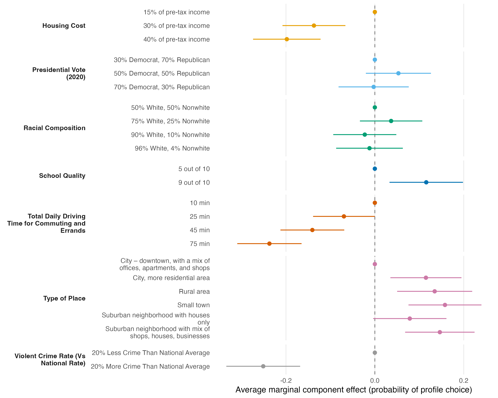

=== ORIGINAL BRIEF ===
# Task T2 — Estimate and report (standard tier)

You are working in a project directory. Use R (`Rscript`); the `projoint` package is installed.

**Data.** Same as T1:

```r
library(projoint)
data(exampleData1)
out <- reshape_projoint(exampleData1,
  .outcomes = c(paste0("choice", 1:8), "choice1_repeated_flipped"))
```

**Task.** Estimate Average Marginal Component Effects (AMCEs) for all seven attributes on profile choice, with uncertainty clustered at the respondent level. Use projoint's estimator, or an explicit alternative with a one-line justification if you deviate.

**Produce, in the current working directory:**

1. `script.R` — one self-contained script; Okabe-Ito palette and theme declared at the top; `set.seed()` before anything stochastic.
2. `figures/amce-dotwhisker.png` — a dot-and-whisker plot of the AMCE estimates with 95% intervals, grouped by attribute, levels ordered within attribute, reference levels shown at zero. 300+ dpi. No in-plot title.
3. `report.md` — a results paragraph of roughly 200 words that a paper could use: the largest effects, their direction and magnitude in percentage points, and one sentence on uncertainty. Place the figure's caption under the figure reference.

**Constraints.** At most one revision cycle. If your mode delegates, use at most 3 delegations. No web access. Do not install packages.

=== PRODUCED: report.md ===
# AMCE results

Profile-level AMCEs (n = 400 respondents, 6,400 profile-choice observations), corrected for intra-respondent measurement error via the repeated-task IRR and clustered by respondent, show that logistical and safety attributes dominate. Raising the local violent crime rate from 20% below to 20% above the national average reduced the probability a profile was chosen by 25.1 percentage points (pp; 95% CI: -33.4, -16.8), the largest effect in the design. A 75-minute daily commute (vs. 10 minutes) reduced choice probability by 23.7pp (CI: -31.0, -16.5), and raising housing cost from 15% to 40% of pre-tax income reduced it by 19.8pp (CI: -27.4, -12.2); intermediate levels of both attributes show smaller, monotonically ordered effects. Among positive effects, living in a small town or a mixed-use suburb (vs. a downtown city) increased choice probability by 15-16pp, and high school quality (9/10 vs. 5/10) increased it by 11.6pp (CI: 3.3, 19.8). Presidential-vote share and racial composition of the neighborhood had the smallest and most uncertain effects: every level's 95% confidence interval overlaps zero. Respondent-clustered confidence intervals are typically ±7-8pp wide, so only the crime, commute, housing-cost, place-type, and school-quality effects are distinguishable from zero at conventional levels.



**Figure.** Average marginal component effects (AMCEs) of seven conjoint attributes on profile choice, corrected for intra-respondent measurement error, with 95% confidence intervals clustered by respondent (n = 400). Reference levels are shown as points at zero with no interval. Levels are ordered within attribute as presented to respondents.

=== PRODUCED: script.R ===
# AMCE estimation and dot-whisker plot for a paired conjoint experiment
# (exampleData1, projoint package), clustered at the respondent level.

suppressPackageStartupMessages({
  library(projoint)
  library(dplyr)
  library(ggplot2)
  library(stringr)
  library(forcats)
})

## ---- Okabe-Ito palette + shared theme (declared up front) -----------------
okabe_ito <- c(
  "#E69F00", "#56B4E9", "#009E73", "#F0E442",
  "#0072B2", "#D55E00", "#CC79A7", "#999999"
)

theme_amce <- theme_minimal(base_size = 12) +
  theme(
    panel.grid.minor = element_blank(),
    panel.grid.major.y = element_blank(),
    strip.text.y.left = element_text(angle = 0, hjust = 1, face = "bold"),
    strip.background = element_blank(),
    strip.placement = "outside",
    legend.position = "none",
    axis.title.y = element_blank(),
    plot.caption = element_text(hjust = 0, size = 9),
    plot.margin = margin(5.5, 5.5, 5.5, 5.5)
  )

set.seed(1234)

## ---- Data -------------------------------------------------------------
data(exampleData1)
outcomes <- c(paste0("choice", 1:8), "choice1_repeated_flipped")
pj <- reshape_projoint(exampleData1, .outcomes = outcomes)

## ---- Estimation ---------------------------------------------------------
# profile-level AMCEs; .auto_cluster = TRUE (default) clusters analytical SEs
# on the respondent id column, matching the task's clustering requirement.
fit <- projoint(
  pj,
  .structure  = "profile_level",
  .estimand   = "amce",
  .se_method  = "analytical",
  .seed       = 1234
)

est <- fit$estimates

# projoint reports both the raw ("uncorrected") AMCE and the AMCE corrected
# for intra-respondent measurement error using the repeated-task IRR (tau).
# We report the corrected AMCE as the headline estimator: it is projoint's
# distinguishing contribution and is the estimand the package is designed
# to produce (see ?projoint), rather than a deviation from it.
amce <- est %>%
  filter(estimand == "amce_corrected") %>%
  select(level_id = att_level_choose, estimate, se, conf.low, conf.high)

## ---- Attach attribute / level labels, reference levels at zero ----------
labels <- pj$labels

amce_labelled <- labels %>%
  left_join(amce, by = "level_id") %>%
  mutate(
    is_reference = is.na(estimate),
    estimate = ifelse(is_reference, 0, estimate),
    conf.low = ifelse(is_reference, 0, conf.low),
    conf.high = ifelse(is_reference, 0, conf.high)
  )

# preserve attribute/level ordering as defined in pj$labels, reference level
# (level1) first within each attribute, remaining plotting order reversed so
# level1 renders at the top of each facet panel.
amce_labelled <- amce_labelled %>%
  mutate(
    attribute = str_wrap(attribute, width = 22),
    level = str_wrap(level, width = 36)
  ) %>%
  mutate(level_f = fct_rev(fct_inorder(paste(attribute_id, level, sep = "__"))))

attr_levels <- amce_labelled %>% distinct(attribute_id, attribute) %>% arrange(attribute_id)
amce_labelled <- amce_labelled %>%
  mutate(attribute = factor(attribute, levels = attr_levels$attribute))

## ---- Plot -----------------------------------------------------------------
p <- ggplot(amce_labelled, aes(x = estimate, y = level_f, color = attribute)) +
  geom_vline(xintercept = 0, linetype = "dashed", color = "grey50") +
  geom_segment(
    aes(x = conf.low, xend = conf.high, y = level_f, yend = level_f),
    linewidth = 0.6
  ) +
  geom_point(size = 2.2) +
  scale_y_discrete(labels = function(x) sub(".*__", "", x)) +
  scale_color_manual(values = okabe_ito) +
  facet_grid(attribute ~ ., scales = "free_y", space = "free_y", switch = "y") +
  labs(
    x = "Average marginal component effect (probability of profile choice)",
    y = NULL
  ) +
  theme_amce

dir.create("figures", showWarnings = FALSE)
ggsave("figures/amce-dotwhisker.png", p, width = 10, height = 8, dpi = 320)

## ---- Console summary for report writing -----------------------------------
amce_out <- amce_labelled %>%
  filter(!is_reference) %>%
  arrange(desc(abs(estimate))) %>%
  select(attribute, level, estimate, se, conf.low, conf.high)

print(amce_out, n = Inf)
cat("\nEstimated IRR (tau):", fit$tau, "\n")

=== QUESTION ===
This is a completed submission against the brief above. What would you change?
