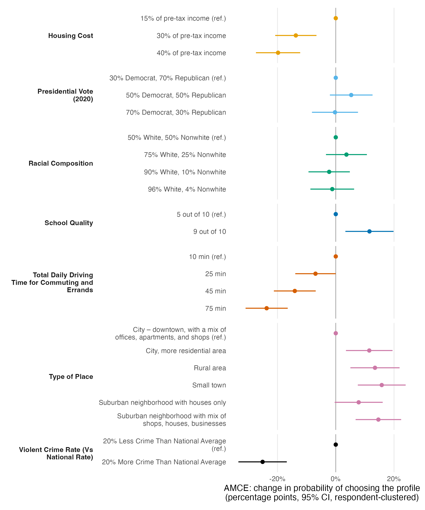

# AMCE results

*Figure 1. Average marginal component effects of neighborhood attributes on the probability of choosing a residential profile. Points are measurement-error-corrected AMCEs from `projoint`; horizontal lines are 95% confidence intervals with standard errors clustered by respondent. Reference levels are shown at zero.*

## Results

Across the seven attributes, safety, commuting burden, and affordability dominate residential choice. A neighborhood with a violent crime rate 20% above the national average is 25.1 percentage points less likely to be chosen than one 20% below it (95% CI: −33.4, −16.8), and lengthening total daily driving time from 10 to 75 minutes reduces the probability of selection by 23.7 points (−31.0, −16.5); the two are statistically indistinguishable and together represent the largest estimated effects in the design. Raising housing costs from 15% to 40% of pre-tax income reduces selection probability by 19.8 points (−27.4, −12.2). Respondents also reward community form and services: relative to a downtown city location, a small town gains 15.8 points, a mixed-use suburb 14.6, and a rural area 13.5, while improving school quality from 5/10 to 9/10 adds 11.6 points. Effects of racial composition and 2020 presidential vote share are small and statistically indistinguishable from zero. All estimates correct for intra-respondent measurement error using the flipped repeated task (estimated intra-respondent reliability 0.83; the correction scales uncorrected AMCEs by roughly 1.5), with 95% confidence intervals based on respondent-clustered standard errors; N = 400 respondents × 8 tasks plus one repeated task.
