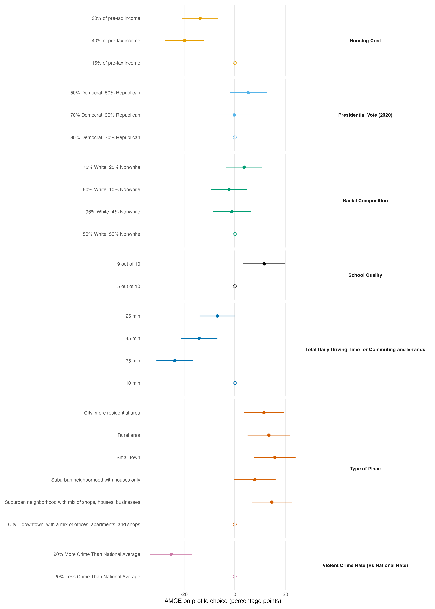

=== ORIGINAL BRIEF ===
# Task T2 — Estimate and report (standard tier)

You are working in a project directory. Use R (`Rscript`); the `projoint` package is installed.

**Data.** Same as T1:

```r
library(projoint)
data(exampleData1)
out <- reshape_projoint(exampleData1,
  .outcomes = c(paste0("choice", 1:8), "choice1_repeated_flipped"))
```

**Task.** Estimate Average Marginal Component Effects (AMCEs) for all seven attributes on profile choice, with uncertainty clustered at the respondent level. Use projoint's estimator, or an explicit alternative with a one-line justification if you deviate.

**Produce, in the current working directory:**

1. `script.R` — one self-contained script; Okabe-Ito palette and theme declared at the top; `set.seed()` before anything stochastic.
2. `figures/amce-dotwhisker.png` — a dot-and-whisker plot of the AMCE estimates with 95% intervals, grouped by attribute, levels ordered within attribute, reference levels shown at zero. 300+ dpi. No in-plot title.
3. `report.md` — a results paragraph of roughly 200 words that a paper could use: the largest effects, their direction and magnitude in percentage points, and one sentence on uncertainty. Place the figure's caption under the figure reference.

**Constraints.** At most one revision cycle. If your mode delegates, use at most 3 delegations. No web access. Do not install packages.

=== PRODUCED DELIVERABLES ===
--- report.md ---


*Figure 1. Average marginal component effects (AMCEs) on the probability that a profile is selected. Points are reliability-corrected estimates from `projoint`; horizontal whiskers are respondent-clustered 95% confidence intervals. Open points denote the reference level for each attribute.*

Using the profile-level conjoint estimator, we find that several attributes substantially shift the probability that a profile is selected. Relative to the reference profile with 20% less crime than the national average, a profile located in an area with 20% more crime was 25.1 percentage points less likely to be chosen (95% CI: -33.4 to -16.8). Longer daily driving time also had large negative effects: 75 minutes, versus 10 minutes, reduced choice probability by 23.7 points (95% CI: -31.0 to -16.5), while 45 minutes reduced it by 14.1 points. Housing cost was similarly consequential: moving from 15% to 40% of pre-tax income reduced choice probability by 19.8 points (95% CI: -27.4 to -12.2). The largest positive effects concerned place type and school quality. Compared with a downtown mixed-use city location, a small town increased the probability of selection by 15.8 points (95% CI: 7.6 to 24.0), and a rural area increased it by 13.5 points (95% CI: 5.0 to 21.9); raising school quality from 5 to 9 out of 10 increased it by 11.6 points (95% CI: 3.3 to 19.8). These intervals are respondent-clustered and exclude zero for the largest effects, whereas several smaller contrasts remain imprecisely estimated.

--- script.R ---
# Reproducible AMCE estimation and figure production
library(projoint)
library(ggplot2)

set.seed(20260717)

# Okabe-Ito palette and common plot theme
okabe_ito <- c(
  "Housing Cost" = "#E69F00",
  "Presidential Vote (2020)" = "#56B4E9",
  "Racial Composition" = "#009E73",
  "School Quality" = "#F0E442",
  "Total Daily Driving Time for Commuting and Errands" = "#0072B2",
  "Type of Place" = "#D55E00",
  "Violent Crime Rate (Vs National Rate)" = "#CC79A7"
)
theme_amce <- theme_minimal(base_size = 10) +
  theme(
    panel.grid.major.y = element_blank(),
    panel.grid.minor = element_blank(),
    strip.text.y = element_text(face = "bold", angle = 0),
    axis.title.y = element_blank(),
    legend.position = "none",
    plot.margin = margin(8, 12, 8, 8)
  )

data(exampleData1)
pj_data <- reshape_projoint(
  exampleData1,
  .outcomes = c(paste0("choice", 1:8), "choice1_repeated_flipped")
)

# projoint's profile-level AMCE estimator; clustering is respondent-level (id).
# The package estimates reliability from the repeated task and returns corrected AMCEs.
fit <- projoint(
  pj_data,
  .structure = "profile_level",
  .estimand = "amce",
  .se_method = "analytical",
  .clusters_1 = id,
  .se_type_1 = "stata",
  .clusters_2 = id,
  .se_type_2 = "stata",
  .seed = 20260717
)

est <- fit$estimates[fit$estimates$estimand == "amce_corrected", ]
plot_data <- as.data.frame(fit$labels)
idx <- match(plot_data$level_id, est$att_level_choose)
plot_data$estimate <- ifelse(is.na(idx), 0, est$estimate[idx])
plot_data$conf.low <- ifelse(is.na(idx), 0, est$conf.low[idx])
plot_data$conf.high <- ifelse(is.na(idx), 0, est$conf.high[idx])
plot_data$reference <- is.na(idx)
plot_data$estimate_pp <- 100 * plot_data$estimate
plot_data$conf.low_pp <- 100 * plot_data$conf.low
plot_data$conf.high_pp <- 100 * plot_data$conf.high
plot_data$attribute <- factor(plot_data$attribute, levels = names(okabe_ito))
plot_data$level_display <- factor(plot_data$level, levels = rev(plot_data$level))

dir.create("figures", showWarnings = FALSE)
figure <- ggplot(plot_data, aes(x = estimate_pp, y = level_display, colour = attribute)) +
  geom_vline(xintercept = 0, colour = "grey45", linewidth = 0.35) +
  geom_segment(
    aes(x = conf.low_pp, xend = conf.high_pp, yend = level_display),
    linewidth = 0.6
  ) +
  geom_point(aes(shape = reference), size = 2.2) +
  scale_colour_manual(values = okabe_ito) +
  scale_shape_manual(values = c(`FALSE` = 16, `TRUE` = 1)) +
  facet_grid(attribute ~ ., scales = "free_y", space = "free_y") +
  labs(x = "AMCE on profile choice (percentage points)") +
  theme_amce

ggsave(
  filename = "figures/amce-dotwhisker.png",
  plot = figure,
  width = 10,
  height = 14,
  units = "in",
  dpi = 320
)

=== QUESTION ===
This is a completed submission against the brief above. What would you change?
