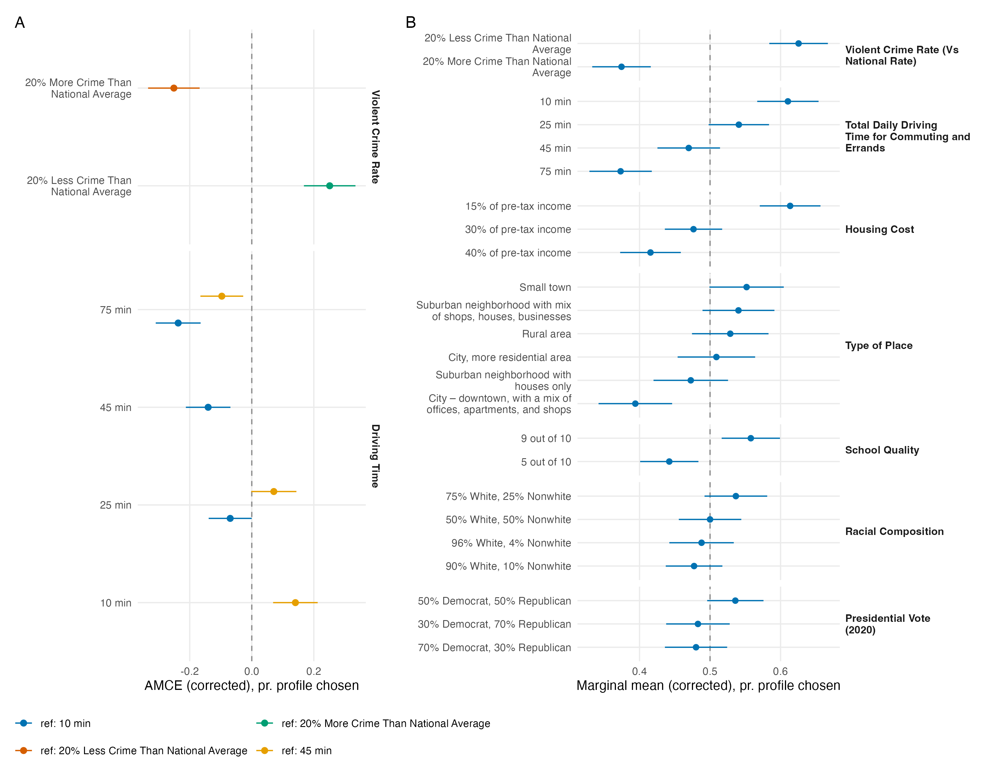

# Reply to Reviewer: baseline dependence of the crime finding

We thank the reviewer for pressing on the reference-category issue. We re-estimated everything under alternative baselines. The short answer: the concern is mechanically correct for multi-level attributes, but no assignment of reference categories can produce the alleged artifact for crime; what softens our claim is sampling error, not baseline choice.

**What we concede.** AMCEs are contrasts against a reference level, and for multi-level attributes the displayed coefficients change with that choice: Driving Time's largest displayed AMCE runs from 23.7 pp (10-minute reference) down to 14.1 pp (45-minute reference), Housing Cost's from 19.8 to 13.7, and under the 45-minute reference their ordering flips. Changing the baseline is a reparameterization — the full set of pairwise contrasts is unchanged; only which contrasts are displayed changes.

**What is robust.** Crime is binary, so it displays 25.1 pp under every configuration: +25.1 pp for the 20%-less-crime level against the 20%-more baseline (95% CI 16.8–33.4), and exactly −25.1 under the reverse reference. No baseline assignment can place any rival's displayed AMCE above crime's point estimate. Marginal means, which involve no reference category, agree (Figure, panel B): 0.626 (low crime) vs. 0.374 (high crime), the largest range of any attribute (25.1 pp, computed from unrounded estimates). All estimates here are measurement-error corrected: τ̂ = 0.172, estimated from the single repeated task, rescales by 1/(1 − 2τ̂) = 1.53 (uncorrected crime AMCE: 16.5 pp). Because this rescaling is common to all attributes, the ordering, z statistics, and p-values are identical on either scale; corrected SEs condition on τ̂. The original tables were uncorrected; the revision will report both once (16.5/25.1) and use the corrected scale throughout.

**What we can no longer claim.** Crime's range does not stand alone: Driving Time's is 23.7 pp, Housing Cost's 19.8 pp. Respondent-cluster bootstrap tests (2,000 draws; contrasts fixed at each attribute's monotone extremes — 10 vs. 75 minutes, 15% vs. 40% of income — set by the design's natural ordering, not re-maximized per draw) give crime minus driving time = 1.4 pp (SE 5.6, p = 0.80) and crime minus housing cost = 5.3 pp (SE 5.5, p = 0.33).

**Revised claim.** Violent crime rate has the largest estimated baseline-invariant marginal-means range (25 pp) and is among the most influential attributes. That range is statistically indistinguishable from daily driving time's (24 pp) and housing cost's (20 pp), so the data cannot rank crime strictly first. These ranges are also relative to the level spans this design used (±20% crime, 10–75 minutes of driving, 15–40% of income), not design-free quantities. We will report marginal means alongside AMCEs, flag the binary structure of the crime attribute, and drop the phrase "drives community choice."

*Panel A: AMCEs for the crime and driving-time attributes under alternative reference categories (color); the binary crime AMCE only changes sign, while for driving time the displayed contrasts change — the underlying contrast set does not. Panel B: baseline-invariant marginal means for all 24 levels, attributes ordered by range; corrected estimates, 95% CIs, respondent-clustered.*
