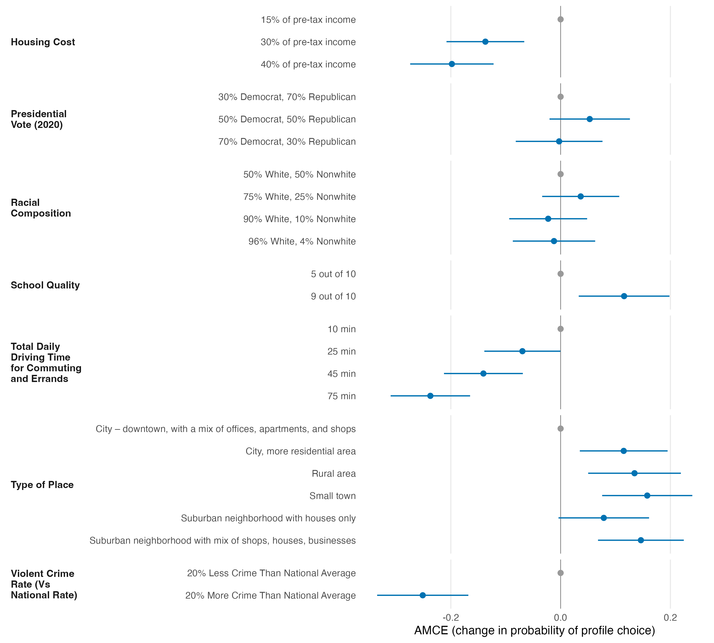

# Results

We estimated IRR-corrected average marginal component effects (AMCEs) for all seven attributes on profile choice (`projoint::projoint`, profile-level, analytical standard errors clustered by respondent, n = 400). The three largest effects were negative, in the expected direction: a violent-crime rate 20 percentage points (pp) above the national average lowered choice probability by 25.1 pp relative to a rate 20 pp below it (95% CI: -33.4, -16.8); raising daily commuting time from 10 to 75 minutes lowered it by 23.7 pp (-31.0, -16.5); and raising housing cost from 15% to 40% of pre-tax income lowered it by 19.8 pp (-27.4, -12.2). The largest positive effects favored non-urban settings over a downtown, mixed-use baseline: a small town raised choice probability by 15.8 pp (7.6, 24.0), a suburb mixing shops and houses by 14.6 pp (6.8, 22.4), and a rural area by 13.5 pp (5.0, 21.9); a 9-out-of-10 school rating raised it by 11.6 pp (3.3, 19.8) over a 5-out-of-10 baseline. By contrast, no level of presidential vote share or racial composition had a 95% interval excluding zero, making these the smallest and least precisely estimated attributes in the set. Because standard errors are clustered at the respondent level, precision reflects the 400 independent respondents rather than the larger pool of choice tasks, and several mid-sized effects (e.g., a 25-minute commute) are only marginally distinguishable from zero.

**Figure 1.** IRR-corrected AMCEs (blue) with 95% confidence intervals, clustered by respondent, for all seven attributes. Grey points mark each attribute's reference level, fixed at zero. Levels are ordered within attribute as presented to respondents; attributes are ordered as in the fielded instrument.
