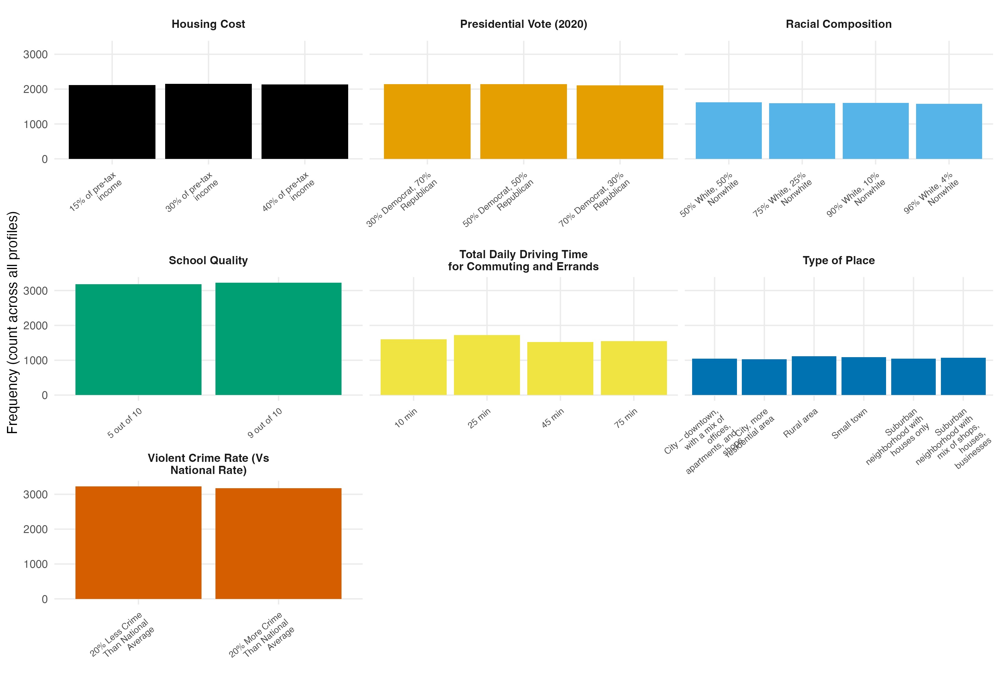

# Conjoint Design Summary

- **Respondents:** 400
- **Tasks per respondent:** 8 choice tasks (plus 1 repeated task for reliability, i.e. `choice1_repeated_flipped`)
- **Profiles per task:** 2

## Attributes

| Attribute ID | Attribute Name | Number of Levels |
|---|---|---|
| att1 | Housing Cost | 3 |
| att2 | Presidential Vote (2020) | 3 |
| att3 | Racial Composition | 4 |
| att4 | School Quality | 2 |
| att5 | Total Daily Driving Time for Commuting and Errands | 4 |
| att6 | Type of Place | 6 |
| att7 | Violent Crime Rate (Vs National Rate) | 2 |

## Randomization Balance Check

Level frequencies across all profiles (400 respondents x 8 tasks x 2 profiles = 6,400 profiles per attribute column). Roughly equal counts per level within an attribute indicate balanced (uniform) randomization.

### Housing Cost (att1)

| Level | Frequency |
|---|---|
| 15% of pre-tax income | 2114 |
| 30% of pre-tax income | 2155 |
| 40% of pre-tax income | 2131 |

### Presidential Vote (2020) (att2)

| Level | Frequency |
|---|---|
| 30% Democrat, 70% Republican | 2144 |
| 50% Democrat, 50% Republican | 2147 |
| 70% Democrat, 30% Republican | 2109 |

### Racial Composition (att3)

| Level | Frequency |
|---|---|
| 50% White, 50% Nonwhite | 1618 |
| 75% White, 25% Nonwhite | 1600 |
| 90% White, 10% Nonwhite | 1605 |
| 96% White, 4% Nonwhite | 1577 |

### School Quality (att4)

| Level | Frequency |
|---|---|
| 5 out of 10 | 3178 |
| 9 out of 10 | 3222 |

### Total Daily Driving Time for Commuting and Errands (att5)

| Level | Frequency |
|---|---|
| 10 min | 1601 |
| 25 min | 1724 |
| 45 min | 1527 |
| 75 min | 1548 |

### Type of Place (att6)

| Level | Frequency |
|---|---|
| City – downtown, with a mix of offices, apartments, and shops | 1047 |
| City, more residential area | 1032 |
| Rural area | 1117 |
| Small town | 1092 |
| Suburban neighborhood with houses only | 1045 |
| Suburban neighborhood with mix of shops, houses, businesses | 1067 |

### Violent Crime Rate (Vs National Rate) (att7)

| Level | Frequency |
|---|---|
| 20% Less Crime Than National Average | 3225 |
| 20% More Crime Than National Average | 3175 |

**Balance summary (min/max frequency and spread within each attribute):**

| Attribute | Min Freq | Max Freq | Spread (% of mean) |
|---|---|---|---|
| Housing Cost | 2114 | 2155 | 1.9% |
| Presidential Vote (2020) | 2109 | 2147 | 1.8% |
| Racial Composition | 1577 | 1618 | 2.6% |
| School Quality | 3178 | 3222 | 1.4% |
| Total Daily Driving Time for Commuting and Errands | 1527 | 1724 | 12.3% |
| Type of Place | 1032 | 1117 | 8.0% |
| Violent Crime Rate (Vs National Rate) | 3175 | 3225 | 1.6% |

Overall, level frequencies within each attribute are close to balanced: five of the seven attributes have a spread below 3% of the mean, while Type of Place (8.0%) and Total Daily Driving Time (12.3%) show larger deviations. This is consistent with uniform random assignment across levels, with the wider spreads on the higher-cardinality attributes reflecting ordinary sampling variation.

## Figure

*Figure 1. Frequency counts of each attribute level across all 6,400 profiles, faceted by attribute, showing that randomization produced roughly balanced level assignment.*

