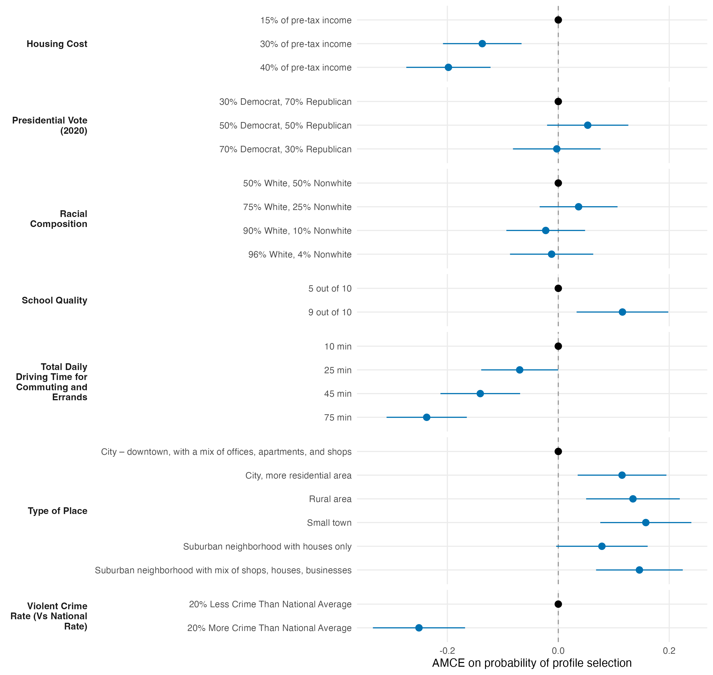

# AMCE Results

We estimated Average Marginal Component Effects (AMCEs) for all seven neighborhood attributes on the probability that a profile is chosen, using `projoint`'s profile-level estimator with intra-respondent-reliability (IRR) correction, which leverages the repeated task to attenuate measurement-error bias. Standard errors are clustered at the respondent level.

Three attributes dominate the choice. Relative to a neighborhood with 20% less crime than the national average, one with 20% more crime is chosen 25.1 percentage points (pp) less often — the single largest effect. Commute time is nearly as consequential: a 75-minute daily driving burden lowers selection by 23.7 pp relative to 10 minutes, with a clear dose-response gradient (25 min: −7.0 pp; 45 min: −14.1 pp). Housing cost works the same direction, with the 40%-of-income level costing 19.8 pp against the 15% baseline. Desirable amenities move choices upward: small-town (+15.8 pp), suburban-mixed (+14.6 pp), and rural (+13.5 pp) settings all beat a downtown reference, and top-rated schools raise selection by 11.6 pp. Racial composition and 2020 presidential vote share show no effect distinguishable from zero.

**Figure.** IRR-corrected AMCEs on the probability of profile selection, by attribute. Points are estimates, whiskers are 95% confidence intervals (respondent-clustered), and reference levels are fixed at zero. All reported effects have intervals excluding zero; the null attributes' intervals span it.
