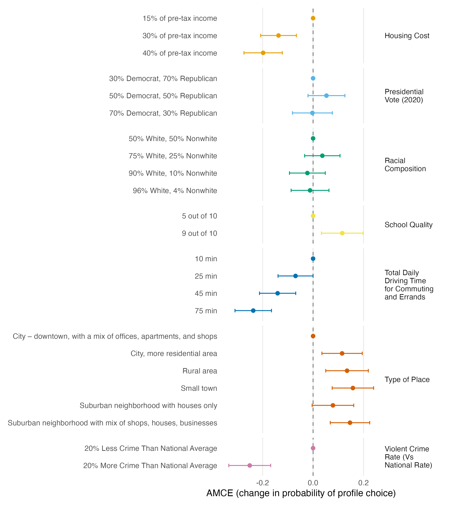

# AMCE Results

Profile choice responded most strongly to violent crime, commuting time, and housing cost. Relative to a violent crime rate 20% below the national average, a rate 20% above it reduced the probability of choosing a profile by 25.1 percentage points (95% CI: -33.4, -16.8). Daily driving time showed a similarly large, monotonic effect: profiles requiring 75 minutes of daily driving were 23.7 points less likely to be chosen than those requiring 10 minutes (-30.9, -16.5), with 45- and 25-minute profiles falling in between. Housing cost showed a comparable pattern: profiles costing 40% of pre-tax income were 19.8 points less likely to be chosen than 15%-cost profiles (-27.4, -12.2). On the positive side, moving away from a dense downtown location raised choice probability by 11 to 16 points across all five alternative type-of-place levels, and better schools (9 of 10 vs. 5 of 10) raised it by 11.6 points (3.3, 19.8). Presidential vote share and racial composition of the neighborhood produced small, statistically insignificant effects at every level, with 95% confidence intervals spanning zero throughout. All estimates use projoint's measurement-error-corrected AMCE, with standard errors clustered on the 400 survey respondents (6,400 profile-choice observations).

**Figure.** Average marginal component effects (AMCEs, IRR-corrected) of seven profile attributes on the probability of profile choice, with 95% confidence intervals clustered at the respondent level (*n* = 400). Reference levels are shown at zero with no interval. Colors distinguish attributes (Okabe-Ito palette); levels are ordered as randomized within each attribute.
