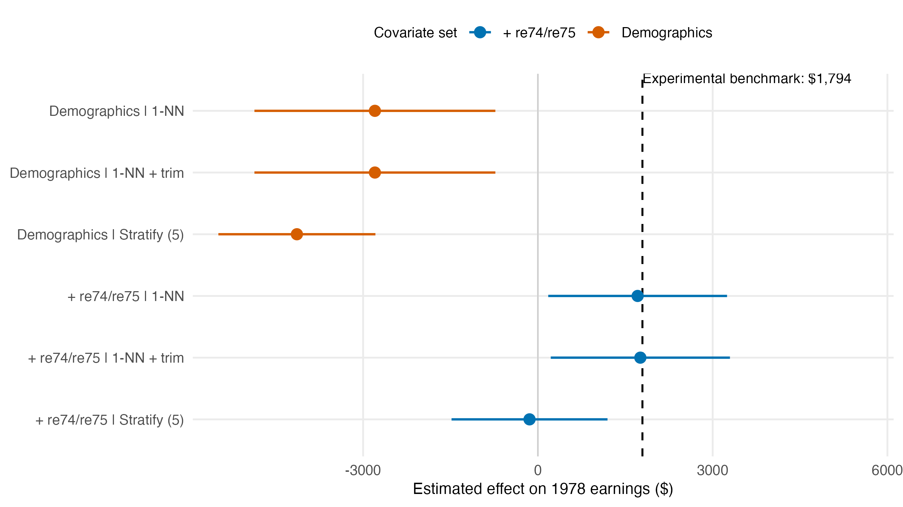

# Memo: does propensity-score matching recover the NSW benchmark?

**Verdict: recovery only under favorable specifications — not robust, and not absent.**

The NSW experiment puts the program's effect on 1978 earnings at **$1,794** [$479, $3,109]. Replacing the experimental controls with the 15,992 CPS observational controls and taking a raw difference gives **−$8,498** — a $10,292 miss, because CPS controls are a far more advantaged comparison population, chiefly on pre-treatment earnings. That gap is what propensity-score adjustment has to close.

It closes only for one combination of choices. Of six specifications, exactly two land near the benchmark: 1-NN matching (with replacement) on demographics **plus** `re74`/`re75`, giving $1,712 and $1,759 (gaps of −$82 and −$36, CIs covering $1,794). Every other specification misses badly and excludes the benchmark: demographics-only 1-NN gives −$2,798 (gap −$4,592); demographics-only stratification gives −$4,137 (gap −$5,931); and — the decisive fact — even the *same* rich covariate set under 5-stratum stratification instead of 1-NN gives −$144 (gap −$1,938, CI excluding $1,794). Trimming to common support changes nothing here; it discards only controls that were never a realized match.

**What conditioning is doing, and what it isn't.** Adding `re74`/`re75` to demographics moves the 1-NN estimate by roughly $4,500, from −$2,798 to +$1,712 — essentially the entire correction. Demographics alone do almost none of it. Pre-treatment earnings evidently capture most of the selection into the NSW program (the population CPS draws from looks nothing like NSW applicants on prior earnings trajectories), and matching on them removes most of that composition bias. But this is not a general proof that selection is ignorable given observables: the same covariates, matched a different way, still miss by nearly $2,000, so the point estimate is riding on the matching algorithm as much as on the covariate set. The winning CI is also close to $3,150 wide — a with-replacement match on 185 treated units against a 16,000-unit pool has real matching variance, so "covers the benchmark" partly reflects low power, not tight agreement. And the whole exercise is checkable only because an experimental yardstick happens to exist; nothing here validates unconfoundedness in a setting without one.

**What a paper may claim:** that when pre-treatment earnings are included in the propensity score *and* nearest-neighbor matching (rather than coarse stratification) is used, the resulting ATT is statistically and quantitatively close to this experiment's benchmark. **What it may not claim:** that propensity-score matching "recovers the experimental benchmark," full stop, or that this exercise validates selection-on-observables as a general strategy. The evidence supports Smith and Todd's fragility critique more than Dehejia and Wahba's recovery claim — recovery is real but conditional on a conjunction of choices, not a property of the method.

*Figure. Point estimates with 95% CIs across six specifications; the dashed line marks the experimental benchmark ($1,794). Orange = demographics only; blue = demographics + `re74`/`re75`.*
