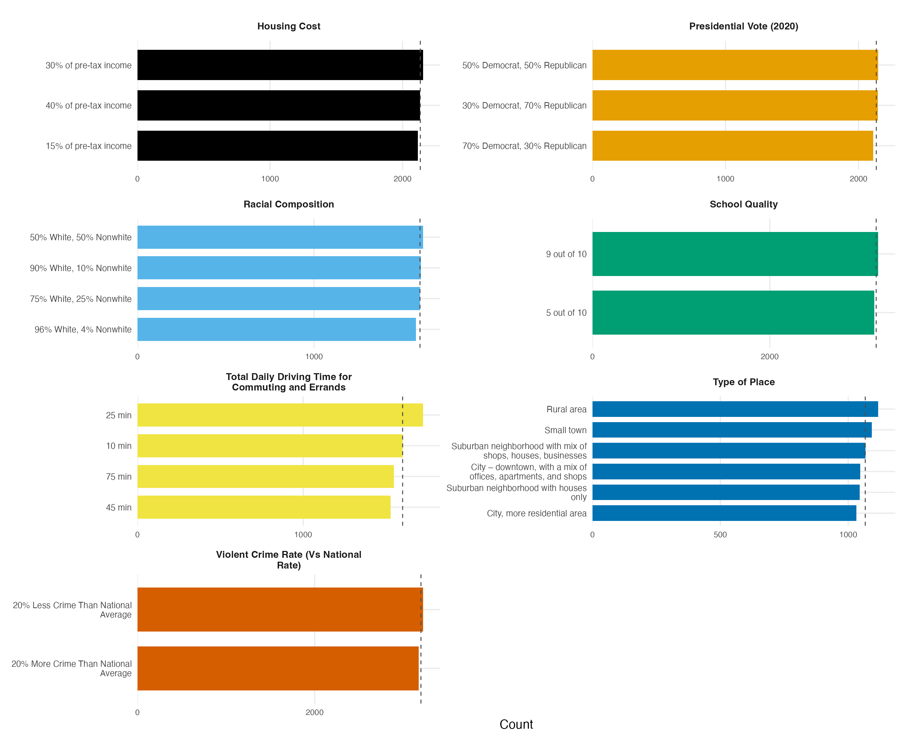

# Conjoint Design Summary

## 1. Design Overview

- Respondents: 400
- Tasks per respondent: 8
- Profiles per task: 2
- Total profile-rows: 6400
- Plus one repeated task (task 1 re-asked with the two profiles flipped) used for intra-respondent reliability; its response is folded into `selected_repeated` and it is not counted as a ninth task or in the profile-row total above.

## 2. Attributes

| Attribute ID | Attribute | Number of Levels |
|---|---|---|
| att1 | Housing Cost | 3 |
| att2 | Presidential Vote (2020) | 3 |
| att3 | Racial Composition | 4 |
| att4 | School Quality | 2 |
| att5 | Total Daily Driving Time for Commuting and Errands | 4 |
| att6 | Type of Place | 6 |
| att7 | Violent Crime Rate (Vs National Rate) | 2 |

## 3. Randomization Balance Check

| Attribute | Level | Observed n | Observed prop. | Expected (uniform) prop. |
|---|---|---|---|---|
| Housing Cost | 30% of pre-tax income | 2155 | 0.3367 | 0.3333 |
| Housing Cost | 40% of pre-tax income | 2131 | 0.3330 | 0.3333 |
| Housing Cost | 15% of pre-tax income | 2114 | 0.3303 | 0.3333 |
| Presidential Vote (2020) | 50% Democrat, 50% Republican | 2147 | 0.3355 | 0.3333 |
| Presidential Vote (2020) | 30% Democrat, 70% Republican | 2144 | 0.3350 | 0.3333 |
| Presidential Vote (2020) | 70% Democrat, 30% Republican | 2109 | 0.3295 | 0.3333 |
| Racial Composition | 50% White, 50% Nonwhite | 1618 | 0.2528 | 0.2500 |
| Racial Composition | 90% White, 10% Nonwhite | 1605 | 0.2508 | 0.2500 |
| Racial Composition | 75% White, 25% Nonwhite | 1600 | 0.2500 | 0.2500 |
| Racial Composition | 96% White, 4% Nonwhite | 1577 | 0.2464 | 0.2500 |
| School Quality | 9 out of 10 | 3222 | 0.5034 | 0.5000 |
| School Quality | 5 out of 10 | 3178 | 0.4966 | 0.5000 |
| Total Daily Driving Time for Commuting and Errands | 25 min | 1724 | 0.2694 | 0.2500 |
| Total Daily Driving Time for Commuting and Errands | 10 min | 1601 | 0.2502 | 0.2500 |
| Total Daily Driving Time for Commuting and Errands | 75 min | 1548 | 0.2419 | 0.2500 |
| Total Daily Driving Time for Commuting and Errands | 45 min | 1527 | 0.2386 | 0.2500 |
| Type of Place | Rural area | 1117 | 0.1745 | 0.1667 |
| Type of Place | Small town | 1092 | 0.1706 | 0.1667 |
| Type of Place | Suburban neighborhood with mix of shops, houses, businesses | 1067 | 0.1667 | 0.1667 |
| Type of Place | City – downtown, with a mix of offices, apartments, and shops | 1047 | 0.1636 | 0.1667 |
| Type of Place | Suburban neighborhood with houses only | 1045 | 0.1633 | 0.1667 |
| Type of Place | City, more residential area | 1032 | 0.1613 | 0.1667 |
| Violent Crime Rate (Vs National Rate) | 20% Less Crime Than National Average | 3225 | 0.5039 | 0.5000 |
| Violent Crime Rate (Vs National Rate) | 20% More Crime Than National Average | 3175 | 0.4961 | 0.5000 |

Observed level proportions track the uniform-expected proportions closely (max absolute deviation = 0.0194, i.e. under 2 percentage points), a substantively negligible imbalance consistent with successful randomization.

## 4. Figure

Observed level counts for each of the seven conjoint attributes, with dashed lines marking the expected count under uniform randomization.
