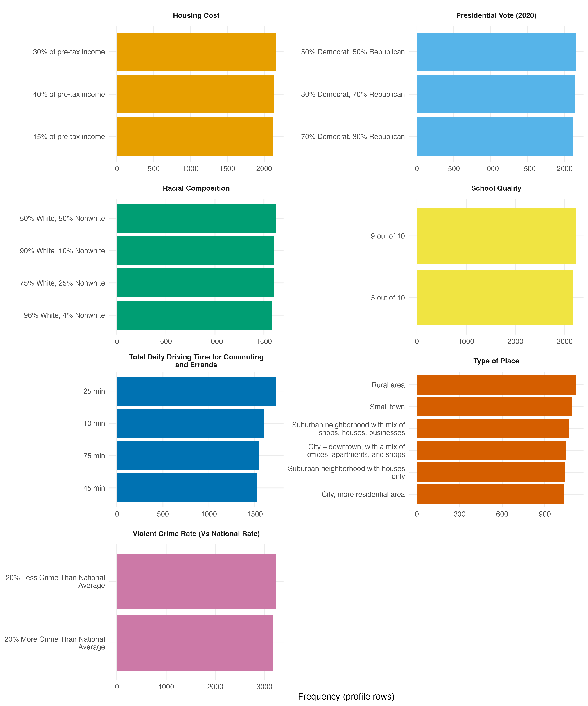

# Conjoint Design Summary

- **Respondents:** 400
- **Tasks per respondent:** 8
- **Profiles per task:** 2
- **Total profile rows (respondents x tasks x profiles):** 6400

## Attributes

| Attribute | Number of levels |
|---|---|
| Housing Cost | 3 |
| Presidential Vote (2020) | 3 |
| Racial Composition | 4 |
| School Quality | 2 |
| Total Daily Driving Time for Commuting and Errands | 4 |
| Type of Place | 6 |
| Violent Crime Rate (Vs National Rate) | 2 |

## Randomization balance check

Level frequencies within each attribute, computed across all 6,400 profile rows.
Under simple randomization, each level's proportion should be close to the expected
uniform proportion (1 / number of levels for that attribute).

### Housing Cost (expected proportion per level: 0.333)

| Level | Count | Proportion |
|---|---|---|
| 15% of pre-tax income | 2114 | 0.330 |
| 30% of pre-tax income | 2155 | 0.337 |
| 40% of pre-tax income | 2131 | 0.333 |

### Presidential Vote (2020) (expected proportion per level: 0.333)

| Level | Count | Proportion |
|---|---|---|
| 30% Democrat, 70% Republican | 2144 | 0.335 |
| 50% Democrat, 50% Republican | 2147 | 0.335 |
| 70% Democrat, 30% Republican | 2109 | 0.330 |

### Racial Composition (expected proportion per level: 0.250)

| Level | Count | Proportion |
|---|---|---|
| 50% White, 50% Nonwhite | 1618 | 0.253 |
| 75% White, 25% Nonwhite | 1600 | 0.250 |
| 90% White, 10% Nonwhite | 1605 | 0.251 |
| 96% White, 4% Nonwhite | 1577 | 0.246 |

### School Quality (expected proportion per level: 0.500)

| Level | Count | Proportion |
|---|---|---|
| 5 out of 10 | 3178 | 0.497 |
| 9 out of 10 | 3222 | 0.503 |

### Total Daily Driving Time for Commuting and Errands (expected proportion per level: 0.250)

| Level | Count | Proportion |
|---|---|---|
| 10 min | 1601 | 0.250 |
| 25 min | 1724 | 0.269 |
| 45 min | 1527 | 0.239 |
| 75 min | 1548 | 0.242 |

### Type of Place (expected proportion per level: 0.167)

| Level | Count | Proportion |
|---|---|---|
| City – downtown, with a mix of offices, apartments, and shops | 1047 | 0.164 |
| City, more residential area | 1032 | 0.161 |
| Rural area | 1117 | 0.175 |
| Small town | 1092 | 0.171 |
| Suburban neighborhood with houses only | 1045 | 0.163 |
| Suburban neighborhood with mix of shops, houses, businesses | 1067 | 0.167 |

### Violent Crime Rate (Vs National Rate) (expected proportion per level: 0.500)

| Level | Count | Proportion |
|---|---|---|
| 20% Less Crime Than National Average | 3225 | 0.504 |
| 20% More Crime Than National Average | 3175 | 0.496 |

## Figure

Frequency of each attribute level across all 6,400 profile rows, faceted by attribute, showing balanced randomization across levels.

