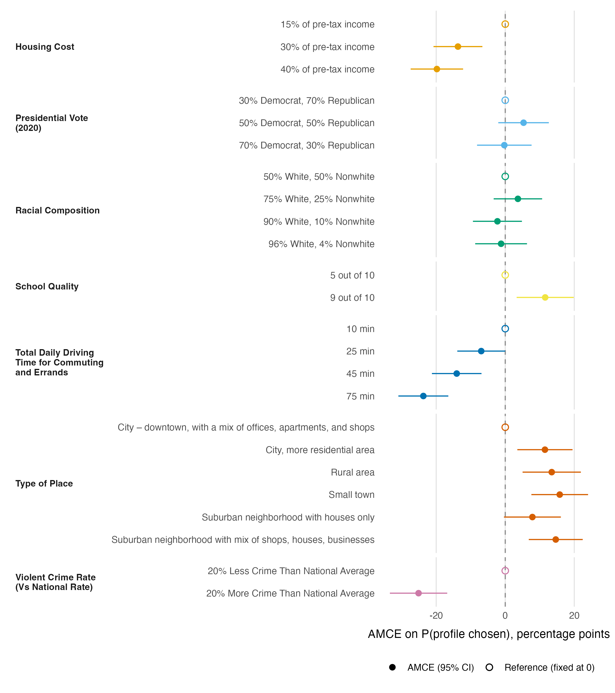

# AMCEs for neighborhood choice

## Results

Figure 1 reports measurement-error–corrected average marginal component effects (AMCEs) for all seven attributes, expressed as percentage-point changes in the probability that a profile is chosen relative to each attribute's reference level. The strongest deterrent is a violent-crime rate 20% above the national average, which lowers a community's selection probability by 25.1 points relative to a rate 20% below average. A 75-minute daily commute lowers it by 23.7 points relative to a 10-minute commute, and both commute time and housing cost decline monotonically: rent at 40% of pre-tax income costs 19.8 points against a 15% baseline. Amenities move choices in the expected direction. Schools rated 9 versus 5 out of 10 raise selection by 11.6 points, and non-downtown locations are generally preferred to a downtown setting, led by small towns (+15.8) and mixed-use suburbs (+14.6). Racial composition and 2020 presidential vote share produce no effect distinguishable from zero. Standard errors are clustered by respondent; the 95% intervals exclude zero for every contrast of roughly 11 points or larger, whereas the racial-composition and presidential-vote levels and the smallest amenity contrasts are statistically indistinguishable from zero. Estimates are corrected for intra-respondent reliability (estimated swap-error rate τ = 0.17), which scales them by roughly 1.52; uncorrected AMCEs share the same signs and ordering and are about 34% smaller.

**Figure 1.** Measurement-error–corrected AMCEs (`projoint`, profile-level estimand) for each attribute level, in percentage points, on the probability that a profile is chosen. Points are estimates and horizontal bars are 95% confidence intervals from standard errors clustered by respondent; open circles mark each attribute's reference level, fixed at zero. Colors distinguish the seven attributes (Okabe-Ito palette). Estimates apply projoint's intra-respondent-reliability correction (swap-error rate τ = 0.17; scaling factor ≈ 1.52).
