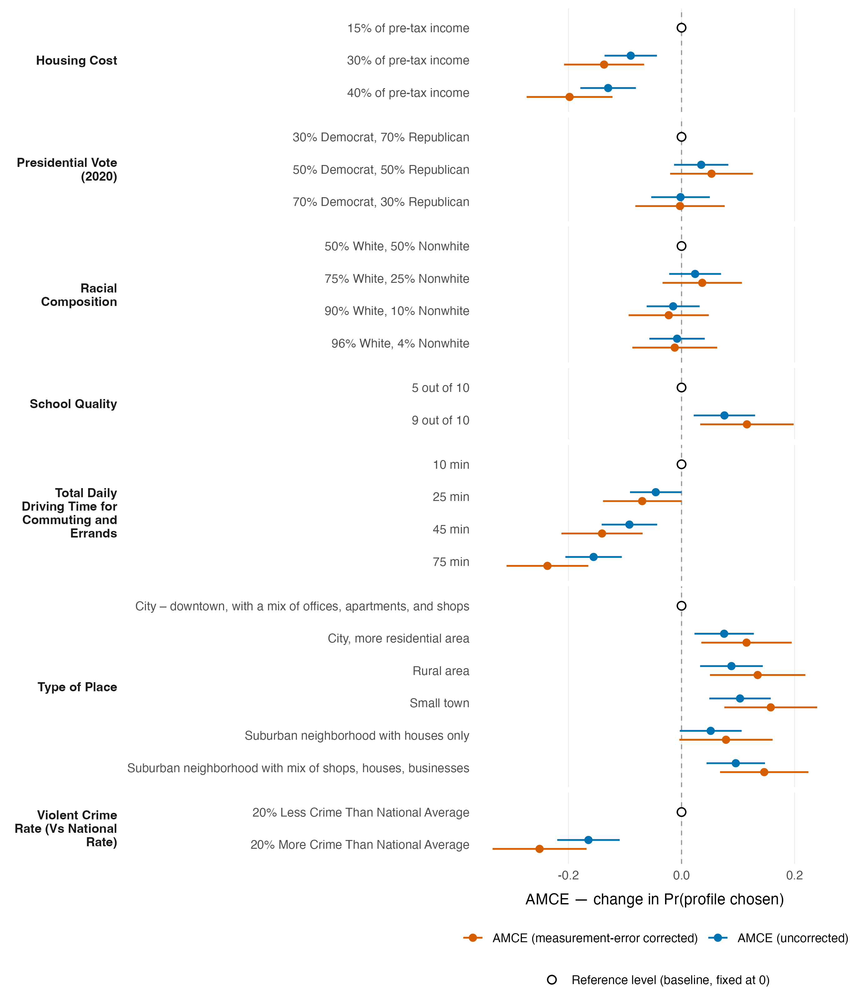

# Results

Figure 1 reports average marginal component effects (AMCEs) for all seven attributes on the probability that a residential profile is chosen, estimated with `projoint` and clustered at the respondent level. We take projoint's measurement-error-corrected AMCEs as the primary estimand and give the conventional uncorrected values in parentheses. The largest effects are penalties. Relative to a neighborhood with 20% less crime than the national average, one with 20% more crime is chosen 25.1 pp less often (uncorrected −16.5), the largest single effect; a 75-minute daily commute lowers selection by 23.7 pp against 10 minutes (−15.6); and housing costing 40% of pre-tax income is chosen 19.8 pp less than at 15% (−13.0). Both cost and commute are monotonic in their levels. Respondents favor less-dense settings over a downtown location: small town +15.8 pp (+10.3), mixed suburb +14.6 pp (+9.6), and rural +13.5 pp (+8.8); a 9-of-10 school rating adds +11.6 pp (+7.6). Presidential-vote share and racial composition are statistically indistinguishable from zero. Intervals are 95% respondent-clustered; because projoint's CR2 variance was not positive-semidefinite, we report its CR1 (Stata) cluster-robust fallback. The correction divides each AMCE by 1−2τ (τ = 0.172, the estimated swapping-error probability), inflating magnitudes roughly 52% without changing any sign.

**Figure 1.** Average marginal component effects on the probability that a residential profile is chosen, grouped by attribute. Points are AMCEs with 95% confidence intervals clustered at the respondent level (blue = conventional/uncorrected; orange = projoint's measurement-error-corrected estimand); levels are ordered within each attribute and open circles mark each attribute's reference level, fixed at 0. Estimates from `projoint` (Clayton et al.), profile-level AMCE with analytical standard errors on respondent id (CR1/Stata fallback after a non-positive-semidefinite CR2).
